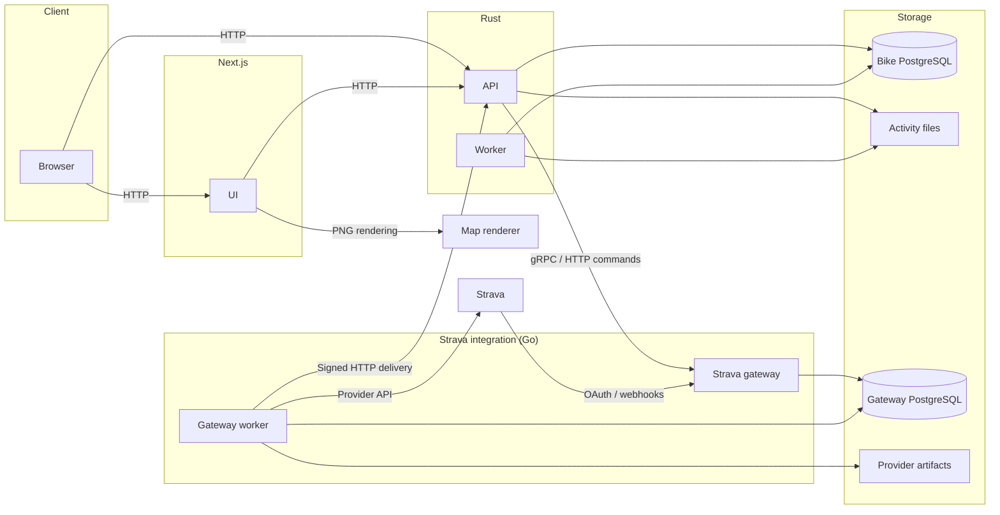

# Bike


**Activity analytics for cross-country and downhill riding.**

Bike brings ride history, route exploration, segment comparisons, and training
progress into one place. Import recordings from your cycling computer or connect
Strava, then explore the data behind your rides.

[Quickstart](#quickstart) · [Development](docs/development.md) ·
[Architecture](#architecture) · [Specifications](bike-rs/docs/specs/README.md)

## What you can do

- **Explore your rides.** Inspect interactive route maps, elevation, heart rate,
  cadence, laps, zones, and matched segments where the recording includes them.
- **Bring your own data.** Upload FIT, TCX, and GPX files, import activity export
  archives, or sync through Strava OAuth and webhooks. Original files remain
  available for download and reprocessing.
- **Compare segment efforts.** Build a segment from an activity or import a
  route, track personal bests, and replay selected efforts together in the race
  viewer.
- **Understand training progress.** Follow fitness, fatigue, and form alongside
  XC endurance and climbing trends, DH consistency, and event readiness.
- **Explore personal heatmaps.** Filter riding history by sport and date on an
  interactive map. Heatmaps are controlled by a feature flag and require prepared
  activity projections; see the [heatmap specification](docs/specs/heatmaps.md).
- **Inspect background work.** Admin views expose import progress, queued tasks,
  integration events, and failures with tools for recovery.

## Quickstart

Install [Docker with Compose](https://docs.docker.com/compose/install/) and
[mise](https://mise.jdx.dev/getting-started.html). Start Docker before continuing.

```sh
git clone https://github.com/ericbutera/bike.git
cd bike
mise trust
mise install
mise run compose:up
```

Open **[localhost:3001](http://localhost:3001)**. The local environment enables a
development account, so no Strava credentials or external identity provider are
needed. The first build downloads dependencies and compiles the Rust services.

The stack starts PostgreSQL, the Rust API and worker, the Next.js UI, and the map
renderer. API and worker services reload Rust source changes; the UI reloads
frontend changes. Database migrations finish before the API and worker start.
Activity data persists across restarts.

| Service    | Local address                           |
| ---------- | --------------------------------------- |
| Bike UI    | [localhost:3001](http://localhost:3001) |
| HTTP API   | `http://localhost:3000/api`             |
| PostgreSQL | `localhost:5432`                        |

To try the import workflow, open [Upload](http://localhost:3001/upload) and select
a FIT, TCX, or GPX activity. Sample GPX recordings are checked in under
[`bike-rs/api/tests/fixtures/platform/uploads/activity-imports`](bike-rs/api/tests/fixtures/platform/uploads/activity-imports).
Those files contain synthetic test data. Importing a ride does not require Strava.

```sh
# Follow startup and import processing.
mise exec -- docker compose logs -f bike-rs worker ui

# Stop the stack; keep the database and uploaded activities.
mise run compose:down
```

See the [development guide](docs/development.md) for port overrides, tracing,
focused checks, contract generation, and startup troubleshooting.

## Architecture



The Rust API and worker share PostgreSQL-backed jobs and retained activity files.
Strava integration has its own database and artifact storage and runs separately
from the local Quickstart stack. See the [architecture guide](docs/architecture.md)
for service responsibilities, privacy boundaries, and data flow.

## Built with

| Layer               | Technology                                                       |
| ------------------- | ---------------------------------------------------------------- |
| Application backend | Rust, Axum, SeaORM                                               |
| Frontend            | Next.js, React, TypeScript, React Query                          |
| Persistence         | PostgreSQL and stored activity files                             |
| Maps                | MapLibre GL, a separate PNG renderer, Rust heatmap tiles         |
| Strava integration  | Go gateway, durable PostgreSQL inbox and delivery jobs, gRPC     |
| Operations          | Docker Compose, Woodpecker CI, Pulumi, Kubernetes, OpenTelemetry |

The Rust backend owns application behavior and data access. The frontend uses a
TypeScript client generated from its OpenAPI contract. Provider fetching and map
rendering have separate service boundaries; the
[architecture guide](docs/architecture.md) explains their responsibilities.

## Repository layout

| Directory                                                      | Responsibility                                                 |
| -------------------------------------------------------------- | -------------------------------------------------------------- |
| [`bike-rs/`](bike-rs/README.md)                                | Rust API, core models and services, worker, schema migrations  |
| [`bike-ui/`](bike-ui/README.md)                                | Rider and admin UI, generated API client                       |
| [`strava-gateway/`](strava-gateway/README.md)                  | OAuth, webhooks, provider quotas, artifact storage, delivery   |
| [`map-renderer/`](map-renderer/README.md)                      | Route preview PNGs and a shared render cache                   |
| [`contracts/`](contracts/openapi/README.md), [`proto/`](proto) | HTTP and gRPC contracts                                        |
| [`bike-rs/api/tests/`](bike-rs/api/tests/README.md)            | Native HTTP integration tests and deterministic fixtures       |
| [`docs/`](docs)                                                | Development guides, design specifications, operations, backlog |

## Development and verification

Shared tool versions live in the root `mise.toml`; components inherit them and
own their specialized pins and commands. `lint` calls `lint:rs`, `lint:go`,
`lint:ui`, and `lint:maps`. Start with the checks for the component you changed:

```sh
mise tasks                  # Discover available tasks.
mise run hooks:install       # Install repository-root prek hooks.
mise run lint               # Run the owning component linters.
mise run compose:config     # Validate local service wiring.
mise run rust:check         # Rust formatting, Clippy, and tests.
mise run ui:check           # UI types, tests, build, formatting, generated client.
mise run test               # Map renderer tests.
mise run strava:test        # Gateway tests.
```

`mise run test:integration` runs the native API integration suite with an isolated
SQLite fixture. `mise run contracts:check` compares canonical contracts and shared asset copies.
`mise run check` runs the combined component, protobuf, and contract checks.

Production synthetics use a standalone k6 image for API health and UI availability. See the [production check instructions](integration-tests/README.md).
Browser regressions live with the [UI](bike-ui/tests/e2e/README.md).

## Documentation

- [Development guide](docs/development.md) — setup, commands, configuration, tracing.
- [Architecture](docs/architecture.md) — service boundaries and data flow.
- [Deployment and CI](docs/deployment.md) — component workflows, image promotion, infrastructure.
- [Product specifications](bike-rs/docs/specs/README.md) — activity, segment,
  training, authentication, and admin behavior.
- [Personal heatmaps](docs/specs/heatmaps.md) — design and implementation evidence.
- [Map rendering](map-renderer/README.md) — render contract, caching, style updates.
- [Strava gateway](strava-gateway/README.md) — configuration, jobs, verification.
- [Production failure runbook](docs/production-failures.md) — diagnosis and recovery.
- [Active backlog](docs/TODO.md) — remaining work and recorded verification limits.

Production infrastructure is maintained in
[`ericbutera/pulumi-iac`](https://github.com/ericbutera/pulumi-iac). Release jobs
publish immutable commit tags, run migrations, and promote the owning component.
The local Compose environment is the starting point for development.
