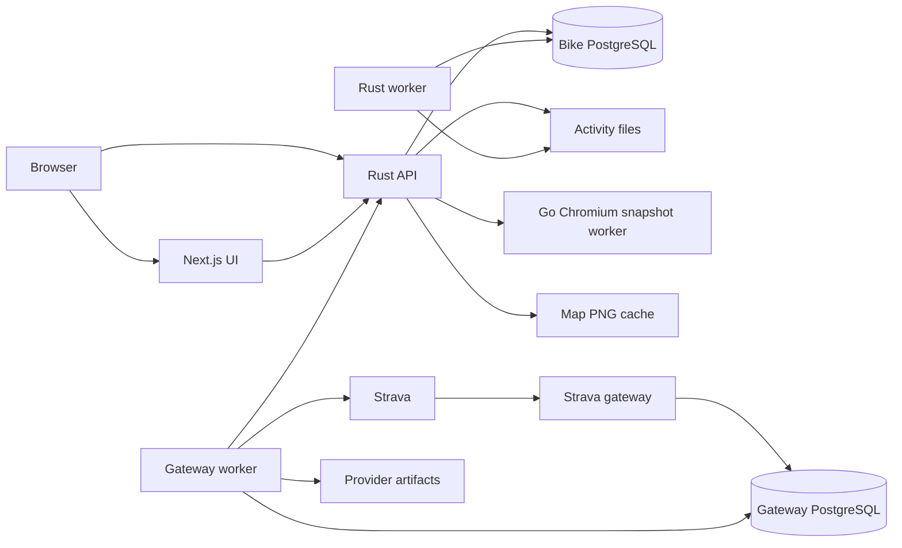

# Bike architecture

Bike has one Rust application backend and one Next.js frontend. PostgreSQL holds
normalized activity records, derived analytics, accounts, and durable jobs.
Original activity files remain available for download and replay.

## Service boundaries

| Component                 | Owns                                                                                                    |
| ------------------------- | ------------------------------------------------------------------------------------------------------- |
| Rust API                  | HTTP adaptation, application services, activity access, authentication, admin operations, map PNG cache |
| Rust core                 | Domain models, database queries, import and segment behavior, analytics, platform modules               |
| Rust worker               | Activity/archive processing, derived-data rebuilds, queued maintenance                                  |
| Next.js UI                | Rider/admin presentation, React Query state, generated API client, private map proxy                    |
| Strava gateway and worker | OAuth credentials, callback persistence, provider quotas, fetching, artifact storage, signed delivery   |
| Map renderer              | Go gRPC snapshots, Chromium lifecycle, serialized MapLibre rendering, loopback browser assets           |

Controllers adapt HTTP requests and responses. Services compose workflows and
policy. Queries live on their owning entity/model modules. Axum and SeaORM
provide routing and persistence; Bike owns its platform modules inside
`bike-rs/bike-core`.

Use SeaORM entities and ActiveModels for ordinary reads, writes, joins,
aggregates, pagination, locks, and conflicts. Use SeaQuery when an expression
needs the database clock or a database function. Keep SQL escape hatches small,
bind dynamic values, and explain the unsupported primitive or atomic operation
beside each one. The retained application SQL covers heatmap writable CTEs and
the PostgreSQL box-overlap expression used by the GiST index. Migration and
fixture DDL remain schema records. The
[shared engineering quality skill](../.agents/skills/bike-engineering-quality/SKILL.md)
defines the review and verification requirements.

## Activity data flow

File uploads and archive imports retain their source data and enter the durable
processing workflow. Parsing normalizes FIT, TCX, or GPX into an activity record.
Processing then matches segments and rebuilds activity and training analytics.
Derived data can be regenerated from retained sources when parsers or rules
change. See the [ingestion specification](specs/activity-ingestion.md).

Strava callbacks are acknowledged after the gateway inbox commits to PostgreSQL.
The gateway worker fetches provider data, stores a content-addressed artifact,
and delivers it to the Rust receiver. Bike does not fetch provider data on the
webhook request path. Retries, quota pauses, and recovery remain visible through
jobs and integration events.

## Maps and privacy

Interactive activity and segment views use MapLibre. Activity-card PNGs pass
through the UI's private image route to the Rust API, which owns access and PNG
caching. A miss calls the Go Chromium worker over gRPC. The
[maps specification](specs/maps.md) defines the HTTP and gRPC contracts,
privacy, cache lifecycle, and required OpenTelemetry visibility.

Personal heatmaps use Rust-owned activity projections and private raster tile
endpoints. Worker preparation and feature flags are described in the
[heatmap specification](specs/heatmaps.md).

## Contracts and ownership

- Rust generates the canonical HTTP contract directly in `contracts/openapi/`.
  The frontend and test harnesses consume its YAML and JSON representations.
- `bike-ui/lib/openapi/react-query/api.d.ts` is generated from that contract.
- Versioned protobuf definitions under `proto/` describe internal gateway and
  renderer interfaces.
- `mise run assets:sync` copies canonical assets into required build contexts;
  `mise run contracts:check` compares those copies with their owners.
- `mise run rust:check` verifies the HTTP contract against fresh Rust output.
- Schema migrations are append-only records. Preserve their order and history.

## Deployment

Root Docker Compose supplies the local application environment. The gateway has
a separate database development stack. Production definitions and release
promotion are maintained separately.

Woodpecker jobs run checks for the owning component, publish images with
immutable commit tags, and call the Pulumi release helper. Backend promotion
runs migrations before API/worker rollout; the UI, renderer, and gateway have
their own image boundaries. Existing namespace and image names are deployment
identities and do not depend on the repository's display name.

OpenTelemetry supports tracing; internal metrics, dashboards, alerts, and
protected failure captures support diagnosis. See the
[gateway recovery guide](../strava-gateway/README.md#failure-recovery) and
[admin recovery procedures](specs/admin-operations.md#failed-import-recovery) for recovery procedures.
