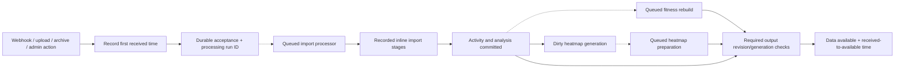

# Received-to-available pipeline visibility plan

- Extend the current Rust worker and Go gateway with complete processing history,
  received-to-available timing, request/trace correlation, processor metrics,
  Grafana visualizations, and detection of anomalous or unnecessary work.
- The [current flow map](worker-current-flows.md) describes existing execution.
- This is a proposal grounded in source revision `0c20deb`, inspected on
  **2026-10-10**. No application changes or live telemetry verification have been
  performed. Track implementation as **WORK01** in [Bike TODO](../TODO.md).

## What exists and what is missing

| Area                 | Existing implementation                                                                           | Gap to close                                                                                                                |
| -------------------- | ------------------------------------------------------------------------------------------------- | --------------------------------------------------------------------------------------------------------------------------- |
| Import DAG           | Shared graph definition, durable attempts, stage states/timestamps, replay, admin activity action | Covers ingestion stages, not every processor, gateway work, or downstream readiness                                         |
| Generic task tracing | Enqueue and execution spans; reusable W3C context helpers                                         | Generic queue records do not persist/extract context; legacy Strava has a special payload carrier                           |
| Task history         | Status, attempt count, start/completion timestamps, last error and heartbeat updates              | No durable per-try ledger or explicit causal/output relationships across all types                                          |
| Pipeline clock       | Individual request/event/task timestamps                                                          | No immutable first-received timestamp carried through every handoff or receipt-to-current/available duration                |
| Processor metrics    | Per-type attempt, success/failure, execution-duration and creation-to-start histograms            | No complete processor inventory/health view, distinct retry outcomes, or accepted-to-ready timing                           |
| Existing percentiles | Execution buckets through 60 seconds; queue-lag buckets through 600 seconds                       | Longer work falls in the unbounded bucket; startup also records synthetic zero observations                                 |
| Admin tasks          | Filtered task list, details, cancel/rerun, elapsed time and visible-page comparison               | Hardcoded type list omits registered types and includes retired types; visible-page baseline is not a population percentile |
| Activity diagnostics | Protected activity-to-import trace endpoint and shared Mermaid modal                              | No complete activity-to-task lineage, fitness/heatmap outcomes, critical-path time, or trace/log navigation                 |
| Grafana worker view  | Provisioned outcome, p95 duration/age, queue-depth, and service trace panels                      | Missing per-type p50/p90, histogram distributions, active-run health, and actionable individual anomalies                   |

Source anchors: [worker metrics](../../bike-rs/bike-core/src/background_jobs/worker/metrics.rs),
[poller](../../bike-rs/bike-core/src/background_jobs/worker/task_worker.rs),
[queue](../../bike-rs/bike-core/src/background_jobs/queue.rs),
[task storage](../../bike-rs/bike-core/src/background_jobs/entities/background_tasks.rs),
[trace helpers](../../bike-rs/bike-core/src/observability.rs),
[legacy trace carrier](../../bike-rs/worker/src/tasks/processors/strava_sync.rs),
[stage records](../../bike-rs/bike-core/src/activity_import_execution.rs),
[rebuild calculations](../../bike-rs/bike-core/src/analytics.rs),
[job submission](../../bike-rs/bike-core/src/jobs/adapter.rs),
[heatmap scheduling](../../bike-rs/bike-core/src/heatmaps/projection.rs),
[heatmap preparation](../../bike-rs/bike-core/src/heatmaps/preparation.rs),
[segment regeneration](../../bike-rs/bike-core/src/segment_regeneration.rs),
[admin tasks UI](../../bike-ui/components/admin/TasksPageContent.tsx),
[activity trace API](../../bike-rs/api/src/controllers/admin.rs), and
[shared trace panel](../../bike-ui/components/activity-detail/ActivityImportTracePanel.tsx).

## One processing run from entry point to required outputs

- This is the proposed visibility and scheduling shape. Current gateway delivery
  ingestion is inline, as shown in the current-flow map; moving it behind durable
  acceptance is an explicit implementation phase.
- Create a stable processing run ID at the first durable acceptance. Persist the
  original receipt and acceptance timestamps, source, owner, graph version, input
  references, and required output profile. Manual replay is a new run linked to
  the earlier run; transport retry stays in the same run.
- Persist logical executions, per-try start/end/outcome/error, causal edges, and
  output targets. A node can represent a queued processor or an inline stage;
  show that distinction. Preserve existing import attempts and stage records as
  their authoritative evidence instead of copying them into a competing ledger.
- Relate runs to imports, activities, archive entries, segments, and user-output
  revisions explicitly. Attach activity identity when parsing creates it, so a
  failed pre-activity import is still findable through its run/import ID.
- Model one-to-many and many-to-many relationships. A user fitness rebuild may
  satisfy several imports; record the output revision and each contributing run.
  Do not join every task for the same user and assume it processed that activity.
  Use bounded pages and shared nodes rather than duplicating large batch graphs.
- Record dependency, enqueue, inline containment, retry, and reuse relationships.
  Retry executions have separate identities; a repeated type is not a cycle in
  the attempt graph. A static graph is the expected plan; persisted execution
  evidence establishes what actually ran. Missing evidence remains unknown.

## Pipeline clock: received to current task to available

- Persist **`pipeline_started_at`** as the first trusted server receipt time for
  that logical input, also exposed as `received_at`. Capture it at the ingress
  handler and retain it with the first durable event/import/run. For Strava, use
  the gateway's webhook receipt or sync discovery time, then carry it to Bike;
  for uploads/archives/admin actions, use the receiving API's ingress time.
  Keep provider event creation/activity time separate from server receipt.
- Keep `accepted_at` as the durable acceptance timestamp and `available_at` as
  the point when all required revision-matched outputs are published/queryable
  through their normal read paths. These milestones answer different questions;
  do not replace receipt with task creation or the first worker start.
- Propagate the persisted start and run identity through gateway delivery,
  enqueueing, inline stages, delayed replacements, retries, and archive children.
  Redelivery/restart must not reset the clock. A manual replay or genuinely new
  input revision starts a new run with its own receipt and a link to the earlier
  run; an archive child retains its batch origin and can also show discovery time.
- A shared rebuild can serve several runs with different start times. Preserve
  each run-to-execution/output relationship and calculate elapsed time per run;
  do not overwrite all origins with the oldest timestamp on a shared task.

| Display/measurement      | Calculation                                                      |
| ------------------------ | ---------------------------------------------------------------- |
| Received to current task | `try.started_at - pipeline_started_at` for the selected try      |
| Received to task result  | `try.finished_at - pipeline_started_at` for that try             |
| Current pipeline age     | `now - pipeline_started_at` while outputs remain unavailable     |
| Received to available    | `available_at - pipeline_started_at` once required outputs exist |
| Accepted to available    | `available_at - accepted_at`, shown as a secondary breakdown     |

- Admin run/activity/task views show the absolute receipt, current stage and
  elapsed-from-receipt, plus final received-to-available duration when ready.
  Publish completed-duration histograms and oldest/current unready-age signals
  separately. Failed/canceled runs show terminal elapsed time and remain outside
  successful availability histograms; missing historical receipt stays unknown.
- Use UTC timestamps from controlled service clocks, preserve their provenance,
  and detect clock skew/negative deltas instead of silently clamping them. Use
  monotonic clocks for local execution durations. Reconciliation must recover
  the real output publication timestamp after a crash, not use discovery time.

## Readiness and timing

- Show separate milestones: accepted, activity stored, analysis ready, fitness
  ready, heatmap ready/skipped, and **data ready**. Required outputs are fixed for
  that run's profile; a disabled feature or ineligible route has an explicit
  not-required/skipped reason. Optional failures remain visible.
- Complete data readiness only when required outputs contain the accepted input
  revision and requested generation. A completed import task or queued follow-up
  is not proof of completed fitness or published heatmap data. Later superseding
  work must not satisfy an earlier run using unrelated output.
- Measure wall-clock **first received → last required output available**. This
  includes queueing, provider waits, retries, and downstream processing; it is not
  the sum of stage durations when branches overlap. Show active execution time,
  queue/retry/provider wait, and critical-path stages alongside total elapsed time.
- Show provider event age and received-to-accepted upload/request duration
  separately.
  Strava webhook receipt, gateway fetching, signed delivery, and Bike processing
  need linked timestamps/IDs to measure the entire received pipeline. Synchronize
  service clocks and report cross-service timing limitations.
- For a running pipeline show current elapsed time and pending blocker, not a
  fictional completion duration. Failed/canceled runs have terminal elapsed time
  and a reason; they never count as successfully ready. Reused stages show their
  origin and add no newly executed processing duration.
- Persist readiness transitions and reconcile missing downstream evidence after
  restart. Avoid declaring readiness from an event that could be lost or from
  trace sampling; durable domain/output state remains authoritative.

## Error log to every processing step

- Carry `pipeline_run_id`, `pipeline_started_at`, logical execution/task ID,
  try number, parent execution, import/attempt/activity identity, and input/output
  version through the shared
  typed submission path and inline processing context. Queue context is metadata,
  not a different hand-built payload convention for each processor.
- Persist and restore W3C `traceparent`/`tracestate` at queue boundaries. Record
  `trace_id` and `span_id` explicitly on processor and stage logs. Carry the
  originating request ID separately; do not manufacture a trace ID from it.
  Reuse the existing helpers and verify the actual enqueue/dispatch paths use them.
  [OpenTelemetry context propagation](https://opentelemetry.io/docs/concepts/context-propagation/)
  defines how services connect these operations.
- Every try gets a processing span; meaningful inline stages get child spans.
  Queued handoffs carry causal context. Shared/coalesced jobs and delayed retries
  can have linked traces rather than one enormous long-lived trace; retain the
  processing run association across them. [OpenTelemetry span links](https://opentelemetry.io/docs/specs/otel/trace/api/#link)
  support multiple causal relationships.
- Admin search accepts request ID, trace ID, run ID, task ID, import ID, or activity
  ID and returns the recorded relationship. Preserve mappings even when an
  unsampled/expired trace is unavailable. A request ID may locate multiple runs.
- Provide links from a failed node to its try, filtered structured logs, and trace
  waterfall using the existing telemetry backend after verifying deployment
  configuration. Telemetry outage must not block business work or erase durable
  run history. Record incomplete diagnostics honestly.

## Queue boundaries and inline functions

- Keep ordinary parsing, validation, model queries, and cohesive stage helpers
  as direct calls. Give meaningful stages recorded outcomes and spans; putting
  every helper on a queue would add scheduling and storage cost without creating
  useful independent recovery boundaries.
- Durably schedule work that needs independent retry, delay, resource admission,
  a distinct processor lifecycle, or cross-process execution. Preserve the
  already queued fitness/segment handoffs. Move heavy gateway-to-API ingestion
  out of the HTTP request after atomically retaining source and accepted intent.
- Inventory archive/bulk loops and extract bounded import/page tasks where
  independent recovery or progress is valuable. A parent must persist counters
  and **return/yield after enqueueing children**; it cannot wait for those children
  while occupying the only sequential worker slot. Completion advances a durable
  coordinator/barrier. Introduce atomic claims before permitting multiple workers.
- Commit output, required follow-up intent, and lineage together where they share
  a database. Surface enqueue failures. Retries, cancellation, and superseded
  revisions need idempotency/fencing; a DAG view alone supplies no execution safety.
- Use shared submission/execution recording across all 13 types, explicit delayed
  replacements, admin reruns, recovery, and gateway delivery. Audit direct storage
  insertion paths so they cannot bypass recording. Reuse the existing typed queue,
  core services, import stage records, and tracing helpers.

## Processor overview, percentiles, and alerts

- Derive inventory from the actual registry, including processors with zero
  executions. Show queued/scheduled/running/retrying/failed counts, recent
  completions, oldest eligible task, heartbeat age, progress age, and next retry.
  Include gateway processing operations as a distinct service in the same view.
- Show **p50 and p90**, sample count, time window, and outcome filter for attempt
  execution, eligible queue wait, and logical task completion. Also show pipeline
  received-to-available percentiles by entrypoint/profile. Do not compute them from
  the currently visible paginated tasks or average worker-local percentiles.
- Use durable per-try data for exact admin attempt detail and windowed aggregates;
  use Prometheus histograms for fleet trends and alerts. Aggregate buckets across
  replicas before computing quantiles. Keep attempts and logical runs distinct:
  failed tries remain visible even when their task eventually succeeds.
- Remove synthetic histogram observations at startup; initialize series without
  representing a fake execution. Extend finite buckets from measured processing
  ranges, including archives/rebuilds. No-sample periods display **N/A**, not zero.
  Verify the current metrics namespace and labels from exported data.
  [Prometheus histogram guidance](https://prometheus.io/docs/practices/histograms/)
  explains population aggregation; [quantile behavior](https://prometheus.io/docs/prometheus/latest/querying/functions/#histogram_quantile)
  explains finite-bucket limitations.
- Use bounded metric dimensions such as service, registered processor type, and
  outcome. Keep request/trace/run/task/activity IDs in persisted relationships,
  logs, and spans rather than metric labels. Show the same filtered population
  and time window in admin and dashboards.
- Add per-type runtime and progress budgets. Alert on overdue eligible backlog,
  running work beyond its budget, stale heartbeat, missing progress, repeated
  retries/exhaustion, or accepted runs missing required outputs. A live heartbeat
  only proves the process is updating its heartbeat, not that it is progressing.
  Scheduled quota waits are explicit waits, not automatically hung tasks.
- Pair completion percentiles with active-age/backlog signals: work that never
  finishes cannot appear in completed-duration histograms. Diagnose slow stages
  and waits separately, with sample counts and actionable run/task links.

## Work volume, amplification, and rebuild correctness

- Measure **worker saturation** and **repeated unnecessary work** independently.
  CPU or task throughput alone cannot identify duplicate rebuilds;
  fast duplicate tasks can keep a worker busy while individual durations look
  normal. Track all queued processors and meaningful inline work through shared
  submission, invalidation, execution, and publication instrumentation.
- Record the scheduling reason/caller, causal run or maintenance operation,
  target scope, input revision/generation, algorithm/configuration version, and
  calculation horizon for each requested/executed unit. Separate ordinary source
  changes, retry, lease recovery, reconciliation, backfill/version upgrade,
  daily freshness, and explicitly forced admin work. IDs and work keys belong in
  durable history/log fields; metric labels use a bounded reason vocabulary.
- Define a comparable work key from processor + owned target scope + relevant
  input/output version. A task may contain many work units and one execution may
  serve many runs. Count actual execution once globally and retain its causal
  links; distinguish scheduling requests, queued tasks, per-item execution,
  retry attempts, and useful output publication. Do not multiply execution
  counters by the number of related activities/runs.

| Signal                   | Required measurement and interpretation                                                                                                                                                       |
| ------------------------ | --------------------------------------------------------------------------------------------------------------------------------------------------------------------------------------------- |
| Load and capacity        | Eligible arrival/completion rates, backlog growth/drain rate, busy/idle wall time per worker, CPU/throttling, memory, and DB/pool wait; separate active compute from blocked I/O              |
| Scheduling amplification | Requests, actual enqueues, suppressed/coalesced requests, and child tasks per accepted input or committed invalidation; show the same window/population and maintenance separately            |
| Execution amplification  | Attempts and expensive work units per distinct target/input revision; break out retries, lease recovery, and parallel duplicate executions                                                    |
| Useful work versus churn | Changed outputs, already-current/skipped units, stale/superseded units, failed units, and expensive recomputation with unchanged inputs/output; separate cheap guards from full recomputation |
| Scan/write amplification | Activities, days, segment candidates, route points/chunks and rows read/written/deleted per changed input; record full/incremental mode, affected scope and scan range                        |
| Rebuild convergence      | Dirty-to-published lag, pending-generation age, repeated invalidation of the same unchanged source, lease expiry/requeue, and outputs that advance only to become dirty again                 |

- Derive expected work from each processor's output/dependency contract and
  workload size, not a blanket one-task-per-activity rule. Compare actual with
  expected fan-out and historical workload cohorts; show sample counts and N/A
  when the denominator is absent. Lifetime/window ratios can be distorted by
  backlog crossing the window: use run/cohort-linked history for exact
  amplification, and label Prometheus rate ratios as operational trends.
- Capture committed domain invalidations and publication outcomes, including
  trigger/outbox paths. Record per-item outcomes for batch tasks. Attribute
  scoped reads/writes where observable; do not present process-wide CPU or total
  database I/O as exact per-task cost. Use execution time, work counts and DB
  spans together, and compare them with worker resource saturation.

### Specific investigation targets

- **Heatmap:** existing reconciliation runs every 15 seconds, atomically leases
  up to 16 pending projections, and makes leases eligible again after 15 minutes.
  Measure lease recovery while an earlier task is queued/running, duplicate
  processing of the same generation, stale publish rejection, and generation
  churn. Recording recovery can update the source and intentionally create a
  fresh generation; distinguish that transition from an invalidation loop.
  Count geometry work and publications per activity/generation/projection version,
  with old-generation work kept separate from a required new generation.
- **Fitness:** current rebuild loading uses the dirty-from day when present;
  without it, it loads training history and rebuilds from the first activity.
  Measure full/incremental scope, activities read, days computed/written,
  triggering changes, and repeated execution for the same user/input revision.
  Include the end date/calculation horizon so a legitimate daily freshness update
  is not labeled redundant. Detect dirty input advancing during a rebuild and
  prove the newer change still requires work after the earlier publication.
- **Segments:** current user regeneration rebuilds segment/activity analytics
  inside its per-activity loop; standalone effort regeneration also calls those
  rebuild functions inline. Deduplication of IDs inside a queued payload does
  not establish deduplication across executions. Measure repeated rebuilds of
  shared affected segments, activities scanned versus changed, duplicate cache
  writes, and overlapping inline/queued work for the same input revision.
- These are source-grounded audit targets, not confirmed production bugs.
  First collect evidence and expose duplicate/no-progress reasons. Only then
  change batching/coalescing, dirty tracking, lease behavior, or rebuild scope,
  preserving revision safety and received-to-available correctness.

## Grafana dashboard changes

- Update the provisioned **Bike Rust Observability**, **Bike Strava Gateway**,
  **Bike Traces**, and **Bike System Health** dashboards in the owning deployment
  project. Preserve existing dashboard UIDs and links, and commit definitions
  alongside scrape/label mappings and alert rules. Dashboard changes are part of
  WORK01 acceptance, not an optional operational follow-up.
- Current definitions provide worker outcomes, p95 duration/queue age, queue
  depth, gateway queue/lease signals, and recent error/slow traces. Extend those
  surfaces rather than maintaining a second set of similar dashboards. The
  traces dashboard's global one-second cutoff is not a per-processor anomaly
  baseline and is not sufficient to classify archive/rebuild runs.
- Filter by namespace/environment, service, processor type, outcome, and time
  range. Show sample count and the actual measurement window. Select one type
  for a distribution, or repeat the panel for a bounded selection; do not pool
  every processor into a distribution that hides individual behavior.

| View                   | Required panels                                                                                                                                                                          | Purpose                                                                                  |
| ---------------------- | ---------------------------------------------------------------------------------------------------------------------------------------------------------------------------------------- | ---------------------------------------------------------------------------------------- |
| Processor overview     | Registry-derived table; p50/p90 execution and queue wait; attempt/completion/failure/retry rates; sample counts                                                                          | Compare every type, including inactive types, over the selected window                   |
| Duration distributions | Execution and eligible-wait heatmaps plus bucket-count distributions for a selected type                                                                                                 | See changing tails, clusters, and unusually slow runs rather than only a percentile line |
| Live worker health     | Queued/scheduled/retrying/running counts, oldest eligible age, active runtime, heartbeat age, progress age, scrape availability, restarts and resource use                               | Expose incomplete or stuck work that completed-duration histograms cannot show           |
| Received-to-available  | Receipt-to-availability p50/p90/distribution by entrypoint/profile, receipt-to-current-stage timing, pending outputs, oldest unready age and wait/execution breakdown                    | Measure the full pipeline from original receipt and identify its blocking output         |
| Work volume/efficiency | Arrival/completion and backlog trends, busy/idle/resources, enqueue/execution amplification, full/incremental scope, scans/writes, useful/no-op/stale outputs and lease/generation churn | Spot overload, excessive fan-out and repeated rebuild work                               |
| Anomalous runs         | Recent anomaly table with severity/reason, processor, run/task/try, activity when available, duration, baseline/budget, and last progress                                                | Identify an individual outlier and open its evidence                                     |
| Gateway work           | Event/fetch/delivery/sync p50/p90/distributions, quotas and wait reasons, queue age, lease expiry and dead letters                                                                       | Follow provider delays and gateway processing before Bike ingestion                      |

- Use Prometheus's bucketed data for histogram heatmaps; configure the query
  format and panel for already bucketed data, with seconds on the duration axis.
  Do not plot cumulative counter values as raw duration samples.
  [Grafana heatmaps](https://grafana.com/docs/grafana/latest/visualizations/panels-visualizations/visualizations/heatmap/)
  and the [Prometheus query editor](https://grafana.com/docs/grafana/latest/datasources/prometheus/query-editor/)
  document the supported presentation.
- Aggregate histogram buckets across replicas before quantiles; calculate
  p50/p90 and sample counts from the same population/window. Validate bucket
  boundaries, units, zero/sparse traffic, counter resets, and no-data rendering.
  A missing scrape is unavailable telemetry; a type with no executions is N/A.
- Preserve the existing metric contract: Rust emits the processor label as
  `type`; its ServiceMonitor maps it to `task_type` and drops `type`. Dashboard
  selectors must use the ingested label. Gateway histograms use `job_type` and
  `outcome`. Validate the full emitted → scraped → queried path before interpreting
  an empty chart as an idle processor.
- The current duration/lag histograms and outcome counters can supply the first
  panels. Per-type queue states, logical completion/readiness duration, per-try
  outcomes, progress age, amplification/rebuild outcomes, and anomaly results
  need the shared history/metrics changes in this plan. Track each panel's
  producer; do not reference metrics
  that have not been implemented and scraped.
- Emit a structured anomaly event containing recorded run/task/try IDs, reason,
  actual duration, baseline/budget and diagnostic links. Grafana's individual-run
  table can read these events from Loki; durable history remains authoritative
  when logs are sampled, unavailable or expired. Metrics expose bounded counts
  by processor/reason, not one series per task or activity.
- Link anomalies to the admin run/task/activity DAG, filtered Loki logs, and
  Tempo traces using [Grafana data links](https://grafana.com/docs/grafana/latest/visualizations/panels-visualizations/configure-data-links/).
  Preserve time range and safe recorded identifiers. Exact traces may be missing;
  the link to durable processing history must still work.

## Detecting anomalous processor runs

- Share one versioned anomaly policy between admin history, Grafana events, and
  alert counts. Store the rule/reason, evaluated timestamp, observed values,
  baseline window/sample count, and expected range with the run/try. Classification
  records evidence; it must not cancel or replay work automatically.
- Deduplicate evaluations by run/try/rule version and emit events/counter changes
  on state transitions. Reconciliation must not report the same stalled run as
  a new anomaly on every tick. Keep resolved anomalies in the processing history.
- Classify hard operational problems independently of historical sample size:
  eligible work past its wait budget, runtime beyond its type-specific budget,
  stale heartbeat, no meaningful progress within a stage budget, excessive
  retries/exhaustion, or required outputs still absent after their readiness
  deadline. A heartbeat without progress is an explicit stall condition.
- Flag excessive fan-out, repeated expensive work for unchanged inputs,
  overlapping execution of the same work key, and invalidation/requeue loops
  that do not advance required outputs. Show the causal scheduling path, expected
  versus actual work, and measured cost. Successful but redundant work can be
  anomalous even if it is fast and never retries. Expected maintenance, forced
  replay, legitimate new generations and daily freshness have explicit reasons.
- Also compare completed execution time with prior successful runs of the same
  processor, processing version and comparable workload. Use available input
  size/counts, such as archive entries, route records or rebuild activity count,
  to avoid treating a large import as equivalent to a tiny one. Keep workload
  cohorts and versions in the baseline store; bound aggregate metric dimensions.
- Start with an explainable proposed outlier rule: a run exceeds both a configured
  absolute duration floor and **three times the prior cohort's p90**, with at
  least **30 comparable runs in the preceding seven days**. Exclude the candidate
  and future runs from its baseline. These are initial calibration settings,
  not measured production limits; fixture and real-load evidence must establish
  appropriate values per processor.
- With insufficient comparable history, show an insufficient-baseline reason and
  use absolute runtime/progress budgets. Display the actual value, expected value,
  ratio, cohort and sample count; avoid an unexplained score or a baseline taken
  from the current paginated task list.
- Keep queue delay, provider quota wait, active runtime and retries separate.
  Expected scheduled waits have a next eligibility time and reason. They can
  breach a pipeline readiness budget without being mislabeled as a hung executor.
  Known skipped/reused stages do not count as unexpectedly fast executions.
- Surface individual anomalies immediately in run detail and the Grafana table.
  Page/notify only for the configured severity and persistence of actionable
  problems; visual outliers should not all become pages. Include task/run links,
  the failing stage, current blocker, and a runbook in each alert.

## Footprint and history retention

- Persist compact IDs, timing/outcome facts and causal/output links. Keep source
  files, parsed checkpoints and GPS arrays in their existing owners; avoid
  copying them into history, anomaly events or spans. Bound archive/page graphs,
  queries, dashboard rows, connection pools and in-memory working sets.
- Index the run/task/activity relationships and time-window aggregates. Compute
  cohort summaries from bounded history rather than loading all previous runs
  into the worker. Measure added worker memory, database bytes/WAL per execution,
  log volume, query latency and daily growth using representative inputs.
- Propose a 30-day diagnostic-history window, subject to measured storage and
  product replay/audit requirements. Retain active/unready runs and dependencies;
  preserve the existing authoritative import/replay history. Cleanup must not
  erase evidence still required to explain pending outputs or a recorded anomaly.

## Admin interaction and rollout

- Extend the existing activity action/modal to **View processing pipeline**.
  Reuse the shared graph/timing components in activity details, import history,
  task details, and run search; keep diagnostics behind admin authorization.
  Show all related processing runs with attempts and readiness milestones.
- A selected run shows its DAG plus timeline: queued processor versus inline
  stage, status, wait/runtime/total timing, retries, error, output revision, and
  links to logs/traces. Show original receipt, receipt-to-selected-task timing,
  availability, and actual versus expected work with the scheduling reasons.
  Preserve the existing import replay controls and source
  ownership validation; do not expose raw source files or GPS arrays in graphs.
- Deliver in stages: (1) persisted original receipt, shared causal metadata and
  per-try history; (2) accurate metrics, work-volume/rebuild audit instrumentation,
  processor inventory and Grafana distribution/health/efficiency panels; (3) shared
  anomaly evaluation, Grafana run table, and activity/run DAG with trace/log
  navigation; (4) readiness barriers and received-to-available dashboards, including
  the gateway; (5) targeted scheduling refactors and alert/production verification.
- Verify upload, webhook, archive, replay, and maintenance happy paths; inject
  failure/retry, a response lost after commit, restart, coalesced fitness work,
  a failed downstream output, and a heartbeat-without-progress stall. Prove an
  error's request/trace ID locates every recorded step and related retry.
- Use known timestamps to verify receipt-to-task and receipt-to-availability
  calculations across gateway delivery, queue delay, retry, restart, archive
  children, and coalesced rebuilds serving differently timed runs. Verify
  redelivery cannot reset the start; stale outputs cannot stop the clock; and
  output recovery after a crash preserves the actual publication time.
- Use bounded work-count fixtures for unchanged-input redelivery, a burst of
  imports for one user, repeated shared-segment updates, queued/running heatmap
  lease expiry, source recovery causing one legitimate new generation, and an
  invalidation loop. Verify full/incremental fitness scope, legitimate daily
  freshness, overlapping rebuilds and a source change arriving mid-rebuild.
  Check exact enqueue/attempt/scan/write/publication counts against the expected
  contract and ensure cheap skips, expensive duplicates and retries stay distinct.
- Compare computed p50/p90 and sample counts against a known timing fixture,
  across multiple workers and zero/sparse traffic. A synthetic fixture validates
  calculations; real traces, deployed image identity, and visible readiness
  validate production wiring. Measure added history/log/storage overhead.
- Validate the provisioned dashboard JSON, datasource references, scrape-label
  mappings and each panel's actual query. Use the deployment project's existing
  `check:bike`, `check:observability:metrics`, and `check:bike:alerting` mise tasks
  where applicable; extend owning checks/fixtures for the new panels and signals.
  Verify alert expressions with [Prometheus rule tests](https://prometheus.io/docs/prometheus/latest/configuration/unit_testing_rules/).
- Test ordinary and large-but-normal runs, a completed outlier, stalled progress
  with a live heartbeat, retry/exhaustion, low samples, a changed processing
  version, quota wait, delayed required outputs, counter reset and missing scrape.
  Assert the expected classification and reason, not just that a chart has data.
- In Grafana, render active and quiet traffic; confirm heatmap bucket counts,
  p50/p90 and N/A behavior, original-receipt timing, amplification/resource panels,
  units/legends, anomaly table entries, and working links
  to the exact run/try/log/trace. Verify the deployed dashboard identity and scrape
  queries after provisioning. Source/fixture checks do not establish live panels.
- Update [admin operations](../specs/admin-operations.md),
  [activity ingestion](../specs/activity-ingestion.md), and owning telemetry
  guidance during implementation. WORK01 completes with all processor types
  covered, correct received-to-available timing/readiness, Grafana distributions,
  health and work-efficiency panels, explainable anomalies including unnecessary
  rebuild work, useful alerts, and verified production correlation.
