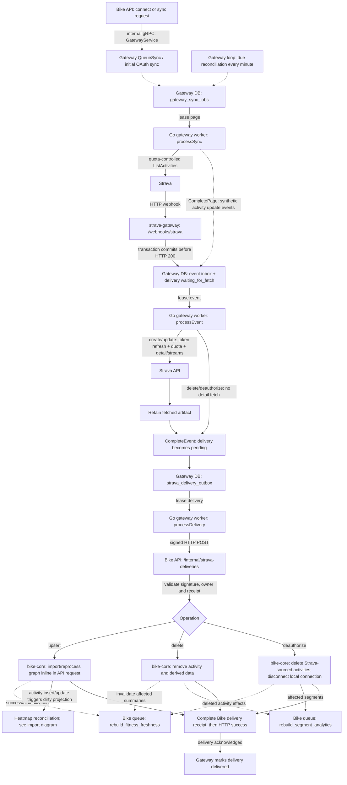
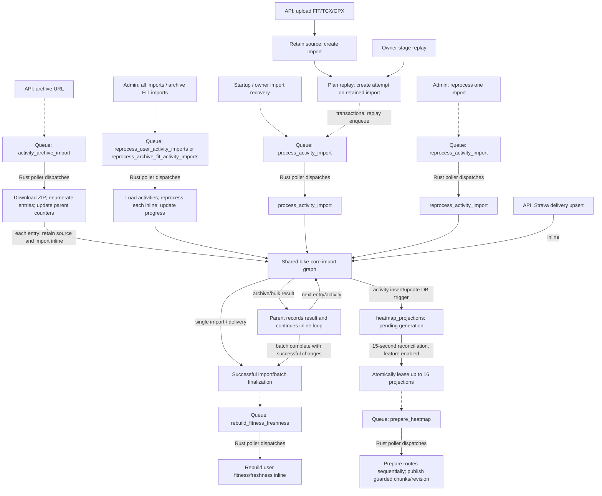
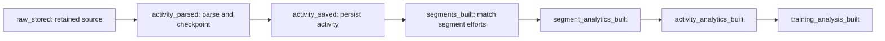
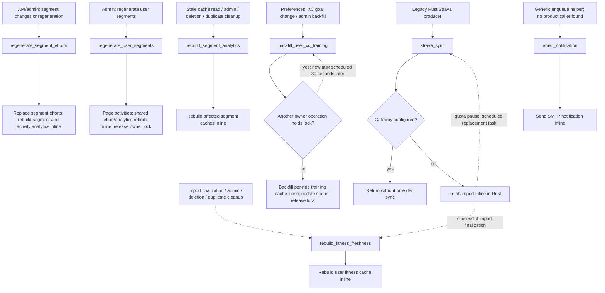
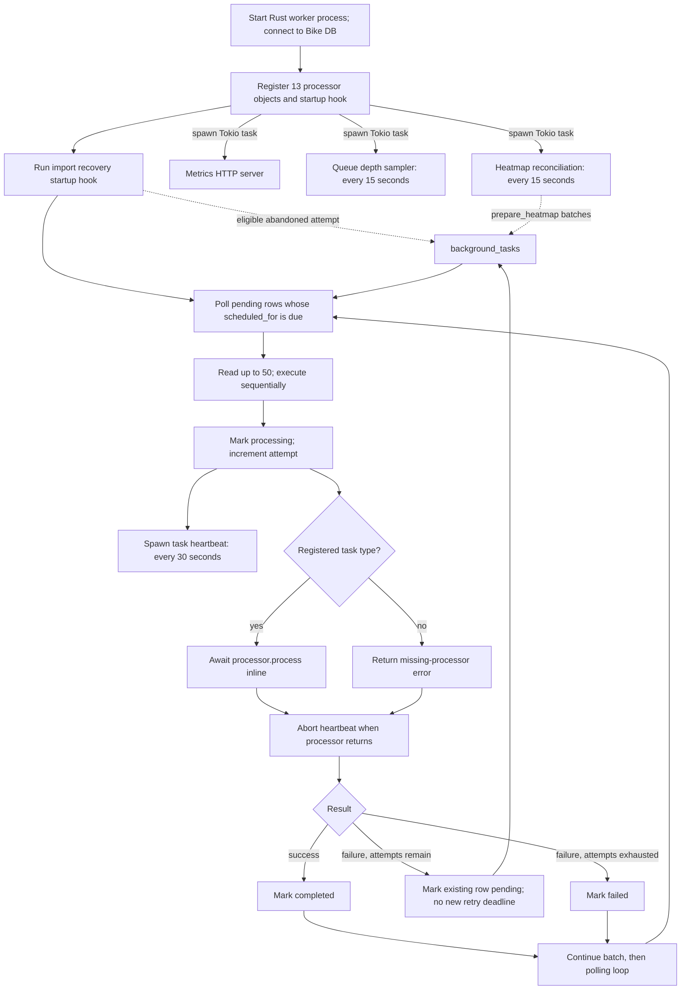

# Current worker triggers and processor handoffs

- Source snapshot: Bike revision `0c20deb`, inspected on **2026-10-10**.
  These diagrams describe the checked-out implementation; production deployment
  identity and runtime behavior have not been verified for this document.
- **Solid arrows** mean an HTTP/gRPC request, an inline function call, a database
  write/read, or execution by a polling loop, as labeled. **Dashed arrows** mean
  durable work is queued for later execution. A queue edge does not start another
  OS process or imply concurrent execution.
- Bike has one Rust processor registry with **13 task types**, and a separate Go
  gateway worker with event, delivery, and sync queues.
- The immediate priority is the [pipeline visibility plan](pipeline-visibility.md),
  using the current worker to connect these paths from acceptance to data ready.

## Strava: webhook and sync converge on gateway delivery

- The gateway inserts `waiting_for_fetch` delivery records when accepting an
  event; fetching makes them ready. Sync listing creates synthetic events and
  advances a persisted page. Both sources then use the same fetch/delivery path.
- The gateway's loop checks **event → delivery → sync** in priority order, handles
  one claimed item per tick, and sleeps two seconds when idle. Quotas and errors
  can defer work using `next_attempt_at`; leases recover interrupted work and
  terminal failures remain visible. This is separate from Bike's task retry loop.
- The current target is `rust`. Bike's existing internal gRPC goes **API → gateway**
  for commands. Activity delivery goes **gateway → API over signed HTTP**.
  A worker-to-core gRPC service is proposed, not currently implemented.
- An upsert currently runs ingestion before acknowledging the delivery. It does
  **not** queue `process_activity_import`. Provider webhook acknowledgment is
  nevertheless independent: the gateway has already committed that callback.
- Upserts for noncycling sports use the deletion path. Deauthorization removes
  Strava-sourced activities and invalidates their fitness/segment summaries
  before forgetting the local connection.

Sources: [webhook acceptance](../../strava-gateway/internal/webhook/webhook.go),
[inbox transaction](../../strava-gateway/internal/storage/inbox.go),
[gateway loop](../../strava-gateway/internal/worker/worker.go),
[sync page handoff](../../strava-gateway/internal/storage/sync.go),
[event completion](../../strava-gateway/internal/storage/jobs.go),
[delivery sender](../../strava-gateway/internal/worker/delivery.go),
[gateway command proto](../../proto/bike/strava/v1/gateway.proto),
[Bike HTTP receiver](../../bike-rs/api/src/controllers/strava_gateway.rs), and
[delivery application](../../bike-rs/bike-core/src/strava_gateway_delivery.rs).

## Upload, replay, archives, and bulk imports

- Archive and bulk processors do **not** create a queued child import for every
  activity today. They call the shared graph inline and queue a fitness rebuild
  at batch finalization when there are successful changes. Scheduling individual
  entry tasks would be an explicit change to this execution structure.
- Owner stage replay uses `process_activity_import` with an attempt and requested
  start stage. The separately registered `reprocess_activity_import` is the admin
  single-import path; the similar names do not represent two mandatory stages.
- Import graph stages execute inside the calling processor or API request. Their
  persisted checkpoints are not independently queued processors. Segment and
  activity analytics are already rebuilt within the graph.
- Duplicate, unsupported, and unchanged inputs can return early; the diagrams
  show successful work and relevant queue handoffs, not every validation branch.
- Activity database triggers invalidate heatmap projections; the reconciliation
  loop later queues preparation. Deletion removes affected projection data and
  changes the user revision rather than preparing a deleted activity.

The existing graph is linear; replay can reuse validated prerequisites:

Sources: [upload/replay endpoints](../../bike-rs/api/src/controllers/activity_imports.rs),
[transactional replay enqueue](../../bike-rs/bike-core/src/activity_import_pipeline/replay.rs),
[recovery](../../bike-rs/bike-core/src/activity_import_recovery.rs),
[import processor](../../bike-rs/worker/src/tasks/processors/process_activity_import.rs),
[archive loop](../../bike-rs/bike-core/src/archive_import.rs),
[bulk/single reprocessing](../../bike-rs/bike-core/src/activity_lifecycle.rs),
[graph definition](../../bike-rs/bike-core/src/activity_import_pipeline.rs),
[finalization handoff](../../bike-rs/bike-core/src/activity_import_lifecycle.rs),
[activity heatmap trigger](../../bike-rs/migration/src/heatmap_projections.sql), and
[projection enqueue/leases](../../bike-rs/bike-core/src/heatmaps/projection.rs).

## Maintenance processors and explicit delayed handoffs

- These boxes name task types; each is selected from the shared `background_tasks`
  table by the same Rust poller. They are not separate independently polling
  processes. Maintenance rebuilds generally call core logic inline and finish.
- XC lock contention schedules a **new task of the same type** and lets the
  current task complete. Legacy Strava quota pauses also schedule replacement
  tasks. Generic task failures instead retry the existing row up to its limit.
- `email_notification` is registered and has an enqueue helper, but no application
  call site was found in this snapshot. Admin rerun can enqueue an existing type
  again. Inventory outstanding rows before retiring any apparently unused type.

Sources: [admin producers](../../bike-rs/api/src/controllers/admin.rs),
[segment producers](../../bike-rs/api/src/controllers/segments.rs),
[activity deletion](../../bike-rs/api/src/controllers/activities.rs),
[segment rebuilds](../../bike-rs/bike-core/src/segment_regeneration.rs),
[user segment operation](../../bike-rs/bike-core/src/segment_regeneration.rs),
[XC producer](../../bike-rs/bike-core/src/xc_goal_backfill.rs),
[XC delayed replacement](../../bike-rs/worker/src/tasks/processors/backfill_user_xc_training.rs),
[legacy Strava](../../bike-rs/bike-core/src/strava.rs),
[typed queue helpers](../../bike-rs/bike-core/src/jobs/adapter.rs), and
[admin rerun/cancel](../../bike-rs/bike-core/src/background_jobs/admin.rs).

## How the Rust worker starts and executes jobs

- Defaults are a 10-second poll interval, 50-row batch, and idle/error backoff up
  to 60 seconds. An individual queued job does not spawn a worker process. The
  background heartbeat and startup loops above are the observed spawned tasks.
- Pending selection and processing update are separate operations; this queue
  does not establish safe atomic claims across multiple Rust worker replicas.
- The scheduler helper is not wired to registered processor schedules. Existing
  scheduling comes from `scheduled_for`, explicit delayed replacements, the
  heatmap loop, and gateway reconciliation, not a cron job per processor.

Sources: [process entrypoint](../../bike-rs/worker/src/main.rs),
[registration](../../bike-rs/worker/src/tasks/mod.rs),
[startup recovery hook](../../bike-rs/worker/src/tasks/startup.rs),
[poller/heartbeat](../../bike-rs/bike-core/src/background_jobs/worker/task_worker.rs), and
[task storage](../../bike-rs/bike-core/src/background_jobs/entities/background_tasks.rs).

## Complete processor inventory

| Registered task type                     | Observed producer                                       | Inline work                                                    | Queued handoff                                                                    |
| ---------------------------------------- | ------------------------------------------------------- | -------------------------------------------------------------- | --------------------------------------------------------------------------------- |
| `prepare_heatmap`                        | Projection reconciliation and heatmap backfill          | Prepare projection batch and publish generation-guarded chunks | None                                                                              |
| `process_activity_import`                | Upload, owner stage replay, import recovery             | Shared graph for accepted attempt                              | Fitness on successful finalization; heatmap through dirty state                   |
| `reprocess_activity_import`              | Admin single-import reprocessing                        | Shared replay graph                                            | Fitness on successful finalization; heatmap through dirty state                   |
| `activity_archive_import`                | Archive URL endpoint                                    | Download ZIP; retain and import entries; parent progress       | Fitness at successful batch finalization; heatmap through activity changes        |
| `reprocess_user_activity_imports`        | Admin bulk reprocessing                                 | Reprocess user activities in parent                            | Fitness at successful batch finalization; heatmap through activity changes        |
| `reprocess_archive_fit_activity_imports` | Admin archive-FIT reprocessing                          | Same bulk processor with filter                                | Same as bulk reprocessing                                                         |
| `regenerate_segment_efforts`             | Segment changes and admin regeneration                  | Replace efforts and rebuild segment/activity analytics         | None                                                                              |
| `regenerate_user_segments`               | Admin user regeneration                                 | Page activities; replace efforts and rebuild analytics         | None                                                                              |
| `rebuild_segment_analytics`              | Stale cache reads, admin, activity deletion/cleanup     | Rebuild segment caches                                         | None                                                                              |
| `rebuild_fitness_freshness`              | Successful imports, admin, activity deletion/cleanup    | Rebuild user fitness/freshness                                 | None                                                                              |
| `backfill_user_xc_training`              | XC goal changes and admin backfill                      | Lock/status management and per-ride analysis                   | Same type at +30 seconds on lock contention                                       |
| `email_notification`                     | Generic helper and admin rerun; no product caller found | SMTP send                                                      | None                                                                              |
| `strava_sync`                            | Legacy compatibility producers                          | No-op with gateway enabled; otherwise provider sync/import     | Same type on quota pause; fitness after imports; heatmap through activity changes |

- All types can be copied by the admin rerun path. The table lists semantic
  handoffs, not generic failure retries. Heatmap dirty state is a database effect
  followed by reconciliation, not a direct import-to-processor call.
- [Processor implementations](../../bike-rs/worker/src/tasks/processors/) and
  [typed producer definitions](../../bike-rs/bike-core/src/jobs/adapter.rs) are
  the inventory anchors. Update this map with the owning implementation whenever
  task routing or the inline/queued boundary changes.
