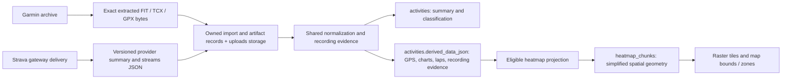

# Activity Ingestion Specification

Bike imports activities from manual files, server-side archive jobs, and Strava sync. Supported cycling activities converge on the same normalized activity pipeline so derived metrics, segments, analytics, and UI behavior remain consistent regardless of source. The retention and admission proposals below separate retaining an input from processing it as a ride or admitting its route to a heatmap.

The 2026-10-06 proposals are design requirements for ACT05 and MAPS12 in
[the Bike backlog](../TODO.md), not implemented or deployed behavior.

The [supported activities specification](supported-activities.md) owns the
cycling inventory, partial non-cycling support, source-specific limitations,
and scope required to promote additional sports. Recognizing a label does not
authorize full processing or heatmap contribution.

## Product Intent

The rider should be able to bring historical and new activity data into Bike without caring which provider or file type produced it. Imports may be slow, but the UI should show queued/running/completed state instead of requiring the browser request to stay open.

Raw inputs should be retained or traceable enough that parser improvements can replay previous imports without asking the rider to upload or reconnect again.

FIT is the gold-standard activity source format for Bike. FIT should be treated as the highest-fidelity source because it can preserve device-native records, developer fields, laps, sessions, events, MTB dynamics, and vendor/device metadata that TCX, GPX, and provider summary APIs either omit or flatten. TCX and GPX are compatibility inputs, not canonical storage targets. Any ingestion path that receives FIT bytes must retain those exact bytes. Any path that cannot get FIT bytes must retain the highest-fidelity raw provider payload it can get without generating a replacement TCX/GPX file.

Mountain-bike telemetry such as grit, flow, jumps, hang time, jump distance, lap/session details, event records, and developer fields must not be discarded when the source format contains them. If the normalized Bike model does not yet expose a field, the import should still preserve enough source data to add that field later and reprocess existing activities.

## Supported Sources

Manual activity upload supports FIT, TCX, and GPX files. FIT should be encouraged first in UI copy and documentation. The upload request stores the original file bytes, creates an activity import record, queues worker processing, and returns accepted status with the import record.

Large Garmin Connect and Strava exports should use the archive import flow instead of the browser upload form. Archive import accepts a shareable HTTPS archive URL. The API creates an archive import job and the worker downloads and scans the ZIP server-side. Archives may contain `.fit`, `.tcx`, `.gpx`, gzip-wrapped activity entries such as `.fit.gz`, and nested ZIP parts such as Garmin Connect `DI-Connect-Uploaded-Files/*.zip`.

Strava sync imports activities through the connected Strava account. OAuth connection, manual re-sync, and webhook-triggered sync should feed the normal per-activity normalization path. Strava's public activity streams endpoint provides typed streams such as time, distance, lat/lng, altitude, velocity, heart rate, cadence, watts, temperature, moving, and grade; it is not an original FIT download endpoint. Strava stream ingestion is therefore provider-derived raw data, not equivalent to a device FIT file.

## Normalization

Every activity admitted for full cycling processing must pass through the same core processing graph. Retention-only inputs stop before full GPS/detail decoding and do not execute the downstream graph. The implementation uses `petgraph` in `bike-rs/bike-core/src/activity_import_pipeline.rs` to model the graph and runs it in topological order, rather than relying on ad hoc call order in each importer.

The current graph nodes are:

1. `raw_stored`: retain enough source metadata and file data to reprocess later;
2. `activity_parsed`: parse the retained source through the reusable activity parser entrypoint;
3. `activity_saved`: insert or update the normalized activity summary and derived detail;
4. `segments_built`: rebuild segment efforts from normalized route points;
5. `segment_analytics_built`: rebuild analytics affected by changed segment efforts;
6. `activity_analytics_built`: rebuild per-activity analytics;
7. `training_analysis_built`: rebuild training analysis from the normalized activity data.

The graph dependencies are encoded in code and validated by tests. Manual upload worker processing, Strava sync imports, archive imports, single-activity reprocessing, and user-level reprocessing should call the graph executor for actual activity data processing. Import-specific code may still handle discovery, download, decompression, authentication, locking, queueing, and provider event logging outside the graph, but it must not parse or normalize activity data with separate techniques.

The `segments_built` stage delegates to the segment processing contract. Activity ingestion owns the import DAG, artifact selection, source replay, and traceability; segment processing owns segment definitions, route matching, effort regeneration, and segment analytics.

The processing graph is observable. `GET /api/activity-imports/processing-graph` returns the canonical DAG as nodes, edges, and Mermaid `flowchart TD` text derived from the same graph definition used by the executor. `GET /api/activity-imports/{id}/trace` overlays a specific import's current stage and `activity_processing` integration events on that graph so operators can see which stages completed, failed, or remain pending.

### Cross-implementation regression data

The Rust import suite uses `import-analytics-ride.gpx`: a seven-point,
30-minute ride with heart-rate and cadence samples and 60 meters of elevation
gain. The owning pipeline and worker tests verify normalization, processing
stages, segment/activity analytics, training and fitness, retained source data,
and replay behavior. Provider-derived fixture provenance is documented in the
[gateway fixtures](../../strava-gateway/internal/provider/testdata/README.md).

Raw storage intentionally precedes activity parsing for all retained file imports. This means fingerprint duplicates can leave a duplicate import row that points at the duplicate raw source and the existing activity. Provider-correlation duplicates, such as already-seen Strava activity IDs, may still short-circuit before raw storage when no new source artifact would be retained.

The activity import pipeline is guarded by workspace Clippy size and complexity lints. `Cargo.toml` denies oversized functions, excessive argument lists, and excessive cognitive complexity, with thresholds configured in `clippy.toml`. Pipeline changes should split graph node behavior into named helpers instead of growing executor match arms or lifecycle orchestration functions.

Provider-specific fields may be kept as metadata, but user-facing activity behavior should come from the normalized model.

The canonical processing order should be:

1. retain original FIT bytes when available;
2. retain original TCX/GPX bytes when FIT is unavailable;
3. retain provider raw JSON/streams when no activity file is available;
4. build normalized Bike summary/detail records from the richest retained source;
5. build rebuildable analytics and heatmap projections from eligible normalized records.

Under ACT05, inspect sport and recording metadata between raw retention and
full normalization. Only supported cycling activities proceed to steps 4–5.
Unknown sports remain deferred instead of being assumed to be cycling.

The import schema distinguishes authentic originals and provider payloads from historical generated artifacts awaiting retirement. Source-file downloads return retained originals only. An unavailable authentic source has no original-file download; Bike does not serve a generated replacement or use it for replay.

Activity imports carry an explicit `import_version`. The version describes the replay contract for the import record and its retained artifacts, not the parser implementation version. Existing historical imports are version 1. New artifact-aware imports that can retain multiple source artifacts and parse native provider payloads are version 2. Backward-compatible parser improvements should keep the same import version; incompatible source-shape or replay-semantics changes must increment the version and preserve readers for older versions.

## Current FIT-First Implementation

### Generated Strava TCX retirement and source backfill

The 2026-10-06 recovery decision replaces indefinite generated-TCX replay with
backfill to retained authentic sources. Bike must stop generating TCX during
new Strava deliveries and updates. Persist the versioned provider summary and
streams JSON as the primary import artifact and parse it directly. This is
Bike-owned work; the gateway payload format stays unchanged. Original TCX
uploaded by a rider remains a supported input format.

The parser rejects generated artifact labels and the exact retired Bike cycling
export header even if a manual upload or archive entry labels those bytes as
an original. Genuine TCX inputs remain supported. Historical mislabeled copies
must be relabeled as generated and withheld from heatmaps while their authentic
source is recovered; preserve their summaries, normalized GPS, and sole retained
bytes until a verified replacement or an explicit deletion decision exists.
Withholding a source also invalidates its projection generation, removes its
published chunks, and advances the owner's tile revision in the same transaction.

Repair old Bike-generated TCX imports in bounded owner-scoped batches:

1. Recover a verified original from the rider's retained archive data.
   Prefer FIT. Match owned counterparts using absolute GPS time and track
   agreement, not titles or exact summary timestamps. Reject ambiguous matches
   and verify the retained bytes before attaching them to a different import.
2. Otherwise promote a retained Strava provider payload. Existing local raw
   payloads can repair any age of cycling activity without consuming provider
   quota. Historical non-cycling inputs can be promoted as retained sources
   without cycling parsing or replay jobs, preserving their existing data.
   This repair is distinct from ACT05's future metadata-only ingestion path.
3. If neither exists, classify gaps within the last 30 days for incremental
   gateway refresh. Older gaps require archive recovery; never start a full
   historical API sync automatically. Missing or ambiguous originals are an
   explicit unresolved outcome, not permission to keep generated TCX as the
   permanent source of truth.

Use a dry-run inventory before applying repairs. Preserve provider/Bike IDs,
ownership, user classifications, and original artifacts. Reprocess from the
replacement source through the normal graph and rebuild dependent state.
Repeated repair is idempotent. Do not delete the only retained bytes during
recovery; retiring generated-TCX parsing is distinct from deleting historical
evidence. Delete obsolete generated files and their artifact records after a
verified replacement has completed replay. Originals, IDs, summaries, and
normalized detail remain retained. Track unrecovered records rather than
inventing metadata or treating a generated file as an original.

The existing gateway `incremental` mode uses a rolling 30-day window. It cannot
request a selected list of missing IDs through the current Bike command
contract, so a recent refresh also revisits already retained recent activities.
Archive recovery and retained JSON use no Strava requests. Provider refresh is
explicit and uses the gateway's existing quota/retry mechanisms. Strava streams
are provider-derived data, not an original FIT download.

Both first-time connections (`initial`) and ordinary refresh (`incremental`)
use the last 30 days. The inactive legacy Bike sync path also clamps its
cursor to this window so re-enabling it cannot restore full-history fetching.
The recovery command only requests incremental refresh;
it cannot request `initial` or `full`. Older history must come from archives.
An explicit operator-only `full` gateway mode still exists and is not used by
Bike connection or recovery flows. Production pipeline 186 deployed source
recovery and v5 admission, and pipeline 187 deployed the scalar recording gate.
The 30-day initial connection behavior is covered at the gateway boundary;
production backfill used retained archives and payloads with zero Strava requests.

The `recover-generated-imports` binary is included in the API image. A dry run
requires the intended `DATABASE_URL` and mounted `UPLOADS_DIR`, performs no
writes or provider requests, and reports one owned page (default/max 32):

```sh
mise --cd bike-rs run imports:recover -- --user-id <user-id> --limit 32
```

Repeat with the reported `next_after_id` as `--after-id`. Review every outcome
and error before applying the same page with `--apply`. Promotion retains a
separate copy of an archive original and atomically queues the existing
single-activity replay job with up to three attempts. Replay uses the normal
processing graph and heatmap invalidation. Monitor those jobs to completion;
source promotion alone is not a completed heatmap repair. CAS and activity
locking reject stale plans; rejected stale plans remove their newly copied file.
Infrastructure failures retain the copy because commit completion may be
uncertain; inspect the persisted import and queued job before retrying.
Reading one source is bounded to 100 MiB, matching the archive entry limit.

An operator can recover additional originals from an owned Strava archive's
`activities.csv` provider-ID/filename mapping without API usage. Extract exact
original bytes into Bike uploads storage (decompress archive gzip wrappers,
not the underlying activity format), then pass a private JSON manifest to
`--register-manifest <path>`. Each entry contains `import_id`,
`provider_activity_id`, `original_filename`, `storage_path`, `format`,
`checksum_sha256`, and optional `recording_label` from the archive activity type.
The command accepts at most 32 entries and a 1 MiB manifest, is read-only by
default, and registers sources only with `--apply`. It verifies ownership,
provider identity, checksums, format, start time, and cycling GPS agreement.
Repeated registration is idempotent. Rejecting archive type evidence is merged
transactionally and survives replay. Do not commit manifests or export CSVs.

Authentic Strava phone-recording JSON from an archive is retained unchanged as
an `original` with quality `strava_archive_json`. Its metadata and field/value
GPS series are parsed directly; epoch sample timestamps become elapsed seconds
relative to the retained activity start. Native normalization is reused in
memory without writing an intermediate export. Original bytes, including
accuracy and pause fields that are not yet normalized, remain retained.
Non-cycling originals and retained provider JSON require no cycling replay jobs.

After source recovery, run `--cleanup` first as a dry run, then with `--apply`.
This mode pages by **artifact ID**, using the reported cursor independently of
the import recovery cursor. It removes only obsolete generated artifacts whose
replacement bytes verify, whose import is processed, and whose path is no
longer used by any import or other artifact. Failed/pending replay and missing
originals block cleanup. The filesystem deletion precedes metadata removal;
retry accepts an already missing generated file after a database interruption.
The verified original is never removed. Historical migration labels and
synthetic retirement regression tests remain; there is no generated-file writer
or generated-file parser fallback.

`--refresh-recording` reads an owned page of supported cycling activities from
their checksum-verified retained originals/provider JSON and restores missing
recording evidence without replacing normalized GPS or running the ride graph.
It is read-only by default; `--apply` persists only changed context with an owner
and source-version guard. This also repairs old original FIT imports whose
normalized data predates recorder metadata support. Existing virtual/indoor
evidence cannot be cleared, and changed evidence invalidates heatmap geometry.
This mode uses an **activity ID** cursor and makes no provider requests.

`--apply --withhold-unrecovered` marks original-source gaps as unavailable for
heatmap publication while preserving summaries, existing normalized GPS,
provider IDs, and source-recovery records. It deletes no files and makes no
provider requests. Tiles, bounds, zones, and counts exclude unavailable sources;
preparation publishes no chunks. Authentic-source replay restores the primary
format and eligibility subject to the normal recording checks. Removing the
last generated file without a replacement requires an explicit retirement
decision or an updated archive; ordinary cleanup cannot erase the sole source.

`--apply --refresh-recent` explicitly requests one incremental gateway sync if
this page has recent gaps. It revisits all activities in that window rather
than selected IDs, so use it once after collecting the dry-run inventory.
Never substitute a full sync for unresolved historical gaps. Revisit failed
import IDs before advancing the recovery audit; errors produce nonzero exit
status while other records in the page are still examined. Native sources,
missing archives, and ambiguous originals are reported without promotion.
Do not commit recovery reports or original activity files.

Activity imports persist explicit source artifacts in `activity_import_artifacts`. The legacy `activity_imports.format`, `activity_imports.storage_path`, and related columns remain as a compatibility bridge, but processing and download behavior should prefer artifact metadata.

Manual upload and archive import store supported FIT/TCX/GPX bytes as `original` artifacts with source-quality labels such as `fit_original`, `tcx_original`, or `gpx_original`. Archive import sorts supported entries by fidelity before processing, so FIT representations are attempted before TCX and GPX when an archive contains duplicate representations.

Strava sync stores the delivered provider summary and supported streams as a versioned `provider_payload` artifact with `source_quality = strava_streams`. Unknown summary fields are preserved alongside the typed fields, including recorder/source identifiers; explicit Zwift recorder evidence excludes generic `Ride` activities. The parser normalizes this JSON directly into Bike summary/detail data. JSON is the primary input for new deliveries and updates. Bike does not generate TCX, and generated TCX is ineligible for parsing or replay. Obsolete generated artifacts are deleted after verified source recovery and completed replay; missing originals are explicit recovery gaps withheld from heatmaps. Strava streams include `time`, `distance`, `latlng`, `altitude`, `velocity_smooth`, `heartrate`, `cadence`, `watts`, `temp`, `moving`, and `grade_smooth`, with modeled metadata such as `original_size`, `resolution`, and `series_type` when provided.

The activity-processing graph chooses original FIT first, original TCX next,
native Strava archive JSON, original GPX, then the retained provider payload.
Generated exports are excluded. The source-file endpoint returns retained
original artifacts only; provider-payload downloads remain a separate concept.

## Native Strava Provider Parsing

`bike-rs/bike-core/src/strava_provider_payload.rs` defines the versioned `StoredStravaProviderPayload`, including the activity summary, streams keyed by type, and provider stream metadata. The artifact-aware `parse_activity_artifact` path dispatches between file formats and provider payloads; `parse_strava_provider_payload` maps summary and stream data directly into `ActivityDraft` and `ActivityDerivedData`, including route points, chart points, and a full-activity lap.

Processing prefers original FIT, original TCX, native Strava archive JSON, original GPX, then the retained Strava provider payload. Regression tests protect this priority and reject generated-only replay. Genuine rider-uploaded TCX remains supported; Bike-generated TCX records require source recovery.

## Activity and GPS storage

The following describes the current implementation. Bike does not convert
Strava data into a generated TCX file at any storage or processing boundary.
Genuine TCX files supplied in an archive or uploaded by a rider remain
compatibility inputs; they are distinct from Bike's retired generated format.



### Retained source inputs

An archive job records its owner, URL, progress, and outcome. Extraction is
bounded, and supported activity files become owned `activity_imports` and
`activity_import_artifacts` records. Each artifact records its kind, format,
source quality, relative storage path, original filename, byte size, MIME type,
and SHA-256 checksum. The extracted activity bytes live in Bike's uploads
storage, which is a persistent volume in production. The downloaded archive
working copy is temporary and is removed after processing; retaining its URL
does not guarantee that it can be downloaded again. FIT originals are retained
without rewriting them. An archive is a transport source, not proof of the
device or application that recorded an activity.

The Strava gateway owns credentials, quota, provider fetching, and delivery.
Bike persists the delivered activity summary and typed streams in a versioned
JSON artifact and parses that artifact directly. This preserves typed and
unknown activity-summary fields plus supported stream arrays and modeled
stream metadata; it is not an original device FIT file or a byte-for-byte copy
of the entire gateway envelope. Bike's import and
artifact records point at the JSON file in Bike's uploads storage. Subsequent
deliveries replace the retained provider input through the owned import
lifecycle. Admin integration history reads Bike's stored boundary events and
does not fetch source data from the gateway while serving the page.

Older sources are recovered from retained originals or archive exports before
using the gateway. First connections and automatic refresh/backfill requests
are limited to the last 30 days. An unavailable original is recorded as a
recovery gap; Bike must not manufacture a file and label it an original.

### Normalized GPS and published geometry

`activities` contains scalar summary fields, ownership, provider correlation,
sport, rider classification, and the primary import link. Its
`derived_data_json` currently contains the normalized route points, chart
points, laps, and recording context together. Current writes use schemaful
version 2 JSON objects; historical compact version 1 arrays remain readable.
The old integer coordinate representation is not the current write format.

Each normalized route point has latitude/longitude in degrees and elapsed
seconds relative to the activity start, plus optional distance, elevation,
speed, heart rate, cadence, and power. FIT coordinates are decoded from their
native representation. GPX/TCX coordinates and timestamps are parsed directly.
Strava `latlng` samples are aligned with the delivered time and telemetry
streams. Missing GPS remains missing: indoor activities without coordinates
can retain metrics without a route. Replay rebuilds these derived values from
the retained input; the normalized JSON is a cache of interpreted activity data,
not a replacement for authentic source bytes.

Valid coordinates do not prove outdoor travel. Zwift can use real-world
coordinates, including locations inside the US. Recording evidence is retained
separately from transport and sport labels and merged through ingestion,
duplicates, recovery, and replay. Known virtual/indoor evidence excludes a
route from heatmap publication regardless of its coordinates.
`activities.recording_environment` is a small PostgreSQL stored generated
column derived atomically from the retained recording context. Heatmap read
predicates use that column instead of repeatedly loading and parsing the full
GPS payload. The ORM does not write it; an insert, replay, or evidence update
cannot leave its value stale or override it independently. The complete
recorder/evidence context remains in the normalized payload until the proposed
details separation below is implemented.
Policy v5 also excludes non-cycling activities and unavailable original sources
at preparation and every read surface. Unknown recording provenance on an
otherwise supported, available source is still admitted; MAPS12's stronger
admission policy remains a separate proposal.

`heatmap_projections` records per-activity policy version, generation, lease,
status, and bounds. `heatmap_chunks` stores the simplified projected geometry
at the supported zoom bands. These tables already separate map publication
from activity storage, but they do not store the complete normalized GPS track.
Preparation validates coordinates and splits discontinuities rather than
drawing a straight chord across a gap. The observed 120-second gap is included
at the boundary. Revision and generation guards invalidate old contributions
and prevent stale workers from publishing previous geometry. Tiles, bounds,
zones, and counts use current eligible projections; an activity detail route
and a heatmap contribution are different products.

### Proposed separation of activity detail from summaries

Move the large normalized detail payload out of `activities` before scaling
mixed-sport imports and personal/global maps. This is a proposal, not an
implemented schema migration. Retain source files and artifact metadata as
above. Introduce an owned one-to-one `activity_details` table for normalized
GPS/chart/lap data with parser/schema version, source artifact/checksum, and
activity generation. Keep recording and admission decisions available with
the lightweight summary so eligibility checks do not need to load a track.

Prefer one detail payload per activity initially. A row per GPS point would
create millions of rows and indexes without helping the existing sequential
route/analytics consumers. Split GPS into bounded ordered chunks only if
measured memory, partial reads, or parallel processing require it. Heatmap
chunks remain a separately rebuilt publication cache, not the raw track store.

The migration must backfill owned details in bounded batches, compare point
counts/times/coordinates and metrics, switch every detail consumer to an
explicit owning-model read, and verify transactional summary/detail updates,
deletion, replay, stale jobs, and two-owner isolation. Preserve rollback until
the new reads and production backfill are verified, then remove the old JSON
column in a later append-only migration. Do not duplicate the large payload
indefinitely. Measure database bytes, summary-query transfer, detail read
latency, worker memory, and heatmap rebuild cost before choosing chunk sizes.
Deferred run/swim inputs should retain originals and minimal metadata without
creating normalized detail rows until support is explicitly enabled.

## Deduplication

Activity imports must deduplicate against existing user data before creating duplicate activities. Provider identifiers are preferred when available. File checksums and activity fingerprints based on user, start time, duration, and distance are fallback signals.

Duplicate handling should be source-aware. A Strava activity and a Garmin file that represent the same ride should not become two user-visible rides just because they arrived through different paths.

## Non-cycling retention proposal

Bike is a cycling platform. Runs, swims, walks, hikes, and other non-cycling
activities must not consume full ride processing or contribute to cycling
segments, fitness, training, reports, or heatmaps. Retaining their original
input keeps a future feature possible without computing those features today.

| Input                               | Retention                                                                      | Processing now                                                             |
| ----------------------------------- | ------------------------------------------------------------------------------ | -------------------------------------------------------------------------- |
| Supported cycling activity          | Original artifact or delivered provider payload, summary, recording evidence   | Cycling pipeline; heatmap admission is a separate decision                 |
| Non-cycling archive/upload activity | One exact original artifact per distinct input, minimal summary when available | Bounded metadata inspection only; no decoded GPS/detail cache or ride jobs |
| Input with unknown sport            | Original artifact and available metadata, unresolved classification reason     | Deferred classification; no speculative ride or heatmap processing         |
| Non-cycling Strava gateway event    | Existing Bike receipt/event history                                            | Current contract delivers no summary or GPS to retain                      |

Reuse owned `activity_imports` and `activity_import_artifacts`. Imports already
allow `activity_id = null`, and artifacts carry ownership, checksums, format,
size, source quality, and storage location. Extend that lifecycle with an
explicit `deferred` outcome and structured summary/classification metadata;
do not create placeholder active ride records just to retain non-rides.
Minimal metadata includes available provider identity, original sport,
start time, duration, distance, recording claims, artifact checksum, retention
reason, and metadata-parser version. Missing values remain missing.

Do not persist GPS arrays, chart samples, generated exports, segment efforts,
training analyses, analytics caches, or heatmap projections for deferred
inputs. A deferred import is a successful retention outcome, not a parser
failure or an endlessly retried queue item. Archive progress and import traces
must count and explain it separately from unsupported, duplicate, and failed
inputs. Ordinary reprocessing must preserve deferral; promotion requires an
explicit supported-sport policy change or an owned reclassification operation.
Promotion reads the original artifact through the existing parser and graph,
is idempotent, and preserves import history and ownership. New support for a
sport does not automatically authorize its use in a cycling heatmap.

Classify from supplied summaries before decoding track detail where possible.
For files, use the supported parser's metadata path without materializing GPS
arrays. FIT session metadata can occur at the end, so scanning a file can still
cost I/O and decoding work. Archive extraction, checksumming, and raw storage
also have costs. Keep the existing bounded archive expansion, retain only one
blob for an identical owned checksum, and measure bytes retained, peak memory,
metadata time, full decodes, and queued downstream jobs on a mixed-sport import.
Do not claim this design avoids all processing or all storage costs.

Retain exact available originals in the existing artifact store and backup
policy. A provider ID or summary alone does not guarantee future GPS recovery.
Record whether the raw source is present, summary-only, or unavailable; expose
future GPS parsing as possible only when an adequate source was actually retained.

### Unchanged gateway constraint

The current gateway fetches activity details to classify them, skips stream
fetches for non-cycling activities, and completes them with a `delete` delivery
without an activity payload. Bike cannot retain Strava swim/run summaries or
GPS from that message. A delete can also represent provider deletion or
reclassification, so Bike must honor removal without inventing an unsupported
sport or resurrecting a ride. Receipt history is not an activity catalog.

ACT05 can retain non-cycling originals from archives/uploads entirely inside
Bike. It must not change the gateway, query its database, or bypass it with
Bike-owned provider fetching. Summary-only non-cycling Strava deliveries
would need a separately approved gateway contract change; that is outside this
proposal. Bike's deferral policy cannot eliminate detail/list requests that
the unchanged gateway already performs upstream.

## Heatmap admission proposal

Recording evidence, transport source, activity sport, and heatmap eligibility
are distinct concepts. Garmin archive transport does not establish Garmin
recording, and `Ride`, `trainer = false`, US coordinates, plausible motion, or
the absence of a Zwift title do not establish physical outdoor travel.
Metadata-stripped or falsified files can be indistinguishable from real tracks.
Bike can enforce a documented admission policy; it cannot prove real-world
travel for arbitrary imported files.

The proposed default for personal and future global maps is fail closed:

1. Unsupported/non-cycling sport, known indoor/virtual evidence, and an explicit
   exclusion always block contribution. Rejecting evidence takes precedence
   over an outdoor claim, a richer geometry artifact, or a later generic export.
2. Missing, conflicting, or unaccepted outdoor provenance remains `unknown`
   for admission. Retain the activity, but publish no heatmap geometry. This
   also withholds legitimate metadata-poor outdoor rides.
3. Accept only a supported cycling activity meeting a documented outdoor
   evidence rule and the existing geometry checks. Persist the decision,
   reason, evidence references, rule/verifier identifier, and policy version
   separately from the claimed recording environment. `outdoor` in an XML
   extension or a recognized manufacturer name alone is not a trusted verifier.
4. Review can exclude or resolve a retained activity with an auditable reason.
   A personal inclusion override is a rider assertion, not independent outdoor
   proof, and must not automatically qualify for the global map. No override
   silently clears retained virtual/indoor evidence.

The concrete outdoor evidence rules remain a MAPS12 design decision. They must
be documented with their trust limitations and representative sources before
implementation is considered complete. The v5 policy filters non-cycling,
unavailable-source, and known indoor/virtual recordings while admitting unknown
recordings with available cycling inputs. Its `RecordingContext`
`Outdoor` value is a claim, not this proposed admission decision. A synthetic
fixture proving that a rule accepts a claim does not prove the claim trustworthy.

Keep one owning admission policy across every entry path: manual upload,
archive FIT/TCX/GPX, gateway delivery/provider JSON,
duplicate/counterpart matching, replay, and historical generated-source recovery.
Reprocessing and duplicate arrival must merge evidence monotonically.
Persist before scheduling heatmap work and recheck on preparation, publication,
and every read: tiles, zones, bounds, counts, and progress. Policy/evidence
changes invalidate old projections, bump revisions, and remove contributions.
Workers may publish only the current policy and generation. Global
contributions use explicit owner participation and their own revision/removal
lifecycle; personal cache keys and queries remain scoped to the authenticated
owner. See the [heatmap spec](heatmaps.md#cycling-admission-proposal-2026-10-06).

### Required verification

Use synthetic regression data, never private activity exports or CSVs:

- Exercise exclusion and positive outdoor controls at raw retention, metadata
  classification, each existing DAG stage, storage, replay, duplicate/copy
  merging, preparation, guarded publication, and every heatmap read surface.
  Known virtual rides, trainer-tagged generic rides, stripped metadata, and
  unknown recordings must never acquire contributions at a later boundary.
- Positive controls must meet the chosen admission rule and actually produce
  chunks, visible tile pixels, bounds, zones, and mapped counts. Cover valid
  outdoor cycling in the US, Europe, and Asia. Preserve the exact 120-second
  GPS-gap regression and valid long continuous road controls; removing an
  impossible chord must preserve the eligible portions of the ride.
- Rejecting evidence must win regardless of artifact order, missing flags,
  provider correlation, generated export, title edits, or replay. Test stale
  workers, policy-version changes, and contribution removal on reclassification.
- Mixed run/swim/ride archives must retain deferred originals and summaries
  while invoking zero full GPS decodes or downstream ride jobs for deferred
  inputs. Verify later owned promotion, retries, duplicates, and recoverability
  of retained bytes. Gateway tests in Bike must use the existing delete payload
  contract and must not assert unavailable summaries were retained.
- Two owners must remain isolated through queries, jobs, counterpart matching,
  caches, counts, and reprocessing. Future global tests cover participation,
  personal overrides, opt-out, deletion, and removal after eligibility changes.

Unit and native HTTP tests establish these boundary behaviors using mocked
boundaries or in-memory databases with fixtures. Their CI checks need no
PostgreSQL service. The [TEST11 browser gate](../E2E-TODO.md), under implementation
and runtime verification, provisions
its own disposable PostgreSQL environment and verifies uploads accepted through
the real API, queue display, and seeded persisted results visible in the UI.
The default browser gate excludes the worker and does not wait for job execution.
Worker E2E is deferred to a separately selected, opt-in suite; job execution
remains owned by pipeline/worker tests.
Separate opt-in PostgreSQL checks can verify server-specific persisted
eligibility, leases/generations, and queries; release
verification must identify the deployed image and policy, complete migration
and backfill, confirm exclusion and positive controls, and inspect the map.
Passing local tests alone does not establish production recovery.

## Processing State

Long-running import work should be represented explicitly. The upload and import UI can disable new uploads while a reprocess, archive import, Strava sync, or other user-scoped activity job is active.

Manual upload locks are released quickly because the file upload request only queues worker work. Long-lived locks are reserved for background jobs that would conflict with another ingestion or reprocessing path.

Archive jobs expose `queued`, `running`, `succeeded`, and `failed` style state with counters for imported, duplicate, unsupported, skipped, and failed entries. Error samples should be short enough for UI display and debugging.

The upload UI should show recent archive-import jobs so the rider can track progress without holding the original HTTP request open.

## Failure Behavior

Invalid files should fail with field-level validation where possible. Empty uploads, unsupported extensions, malformed multipart data, and payloads above the upload limit should produce clear user-facing errors.

Worker failures should mark the import or archive job failed without losing the source record. A later reprocess path should be able to recover when the parser or source data issue is fixed.

Every activity-processing graph stage should emit an `activity_processing` integration event with `event_type = stage_completed` and payload fields including `import_id`, `activity_id` when known, `source`, and `stage`. Terminal processed, duplicate, and failed outcomes should emit `import_processed`, `import_duplicate`, or `import_failed`. Tests should cover stage event emission so traceability does not silently regress.

## Code Anchors

- Upload and archive API: `bike-rs/api/src/controllers/activity_imports.rs`
- Activity import pipeline: `bike-rs/bike-core/src/activity_import_pipeline.rs`
- Generated-source recovery: `bike-rs/bike-core/src/activity_source_recovery.rs`, `bike-rs/bike-core/src/bin/recover-generated-imports.rs`
- Shared activity parser entrypoint: `bike-rs/bike-core/src/activity_parser.rs`
- Archive importer: `bike-rs/bike-core/src/archive_import.rs`
- FIT support: `bike-rs/bike-core/src/fit_support.rs`
- Activity summary normalization: `bike-rs/bike-core/src/activity_summary.rs`
- Activity detail normalization: `bike-rs/bike-core/src/activity_details.rs`
- Source-file download: `bike-rs/api/src/controllers/activities.rs`
- Strava provider JSON ingestion: `bike-rs/bike-core/src/strava.rs`
- Worker processors: `bike-rs/worker/src/tasks/processors/process_activity_import.rs`, `bike-rs/worker/src/tasks/processors/activity_archive_import.rs`, `bike-rs/worker/src/tasks/processors/strava_sync.rs`
- Upload UI: `bike-ui/components/ActivityImportsPanel.tsx`
- Activity source download UI: `bike-ui/components/activity-detail/ActivityHeaderActions.tsx`

## Follow-up tracking

Follow-up status and priority live only in the [Bike TODO](../TODO.md).
This specification is the behavior reference for DATA04, DATA12–14, DATA17–18,
and ACT04–05. Generated TCX requires backfill to an authentic source; segment
imports remain route-only.
