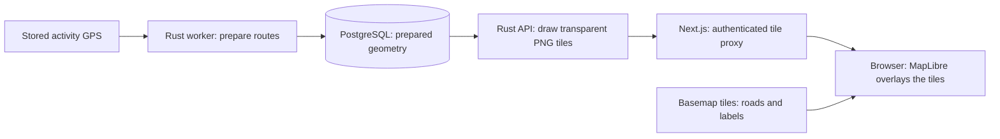

# Personal heatmaps

`/maps` shows the signed-in rider's cycling history as thin lines over a basemap.
More separate rides along a path make its line more opaque.
Access requires authentication and the `heatmaps` feature flag.
Task and deployment status live in [the Bike backlog](../TODO.md#active-work).

## How the lines are drawn today

**The Rust API renders heatmap tiles.** Activity-preview PNGs follow the
[maps specification](maps.md): Rust owns access and caching, and a separate Go
worker snapshots Chromium over gRPC. Heatmap preparation and tile drawing do
not use that worker or its PNG cache policy.

1. **Prepare after import or an edit.** The worker reads one activity's route,
   checks eligibility, removes bad GPS connections, and stores simplified
   coordinate chunks for four zoom bands. It stores geometry, not finished tiles.
2. **Request visible tiles.** MapLibre requests
   `/heatmap-tiles/{z}/{x}/{y}.png` as the rider pans or zooms. `z` is zoom;
   `x` and `y` identify a tile. Next forwards credentials and filters to
   `/api/maps/heatmap/tiles/{z}/{x}/{y}.png` on the Rust API.
3. **Draw on demand.** Rust reads chunks intersecting the tile, filtered by
   owner, sport, and activity start date. It counts each activity's coverage
   once, draws the centerlines, and encodes a transparent **512 × 512 PNG**.
   A cached tile can skip drawing.
4. **Display.** MapLibre overlays the images beneath basemap labels. The browser
   receives tiles rather than every full route. Selecting a color recolors
   existing tiles without requesting new geometry.

There are two independent tile sources in the browser:

| Request                 | Supplies                   | Owner                          |
| ----------------------- | -------------------------- | ------------------------------ |
| `/heatmap-tiles/...png` | Private cycling lines      | Rust API, through Next.js      |
| Basemap provider tiles  | Roads, land, water, labels | Provider selected by map style |

Metadata (`/api/maps/heatmap`) supplies counts, bounds, filters, and a dataset
revision. Zones (`/api/maps/heatmap/zones`) supplies one center per ready route;
MapLibre clusters them into numbered circles at low zoom. Those circles count
activities, not visits along a path.

## Counting and appearance

One **distinct stored activity** counts once at a location. Ten laps in one
activity count once; ten separate activities count ten times. Direction, GPS
sample density, and import retries do not increase heat. Source deduplication
determines which stored activity represents a ride.

A coverage grid allows approximately five meters of GPS tolerance at detailed
zooms. Nearby recordings can share visit counts without identical coordinates.
This is geographic overlap, without road matching; close parallel paths can
merge at low zoom. Counting tolerance does not paint a halo.

Lines are one-pixel centerlines in each 512-pixel tile. Frequency changes opacity
only, using the same scale across tiles and filters:

| Activities covering a path | PNG alpha, out of 255 |
| -------------------------- | --------------------- |
| 0                          | 0: transparent        |
| 1                          | 100                   |
| 2–4                        | 155                   |
| 5–9                        | 195                   |
| 10–24                      | 225                   |
| 25+                        | 255: opaque           |

Tiles use blue `#0060df`. The browser remembers a Blue, Orange, Sunset, Pink,
Purple, or Contrast palette. Recoloring preserves geometry and alpha. Buffered
tile edges prevent seams between neighboring tiles.

## Eligible routes and filters

Current projection policy **v5** excludes non-cycling activities, known
indoor/virtual recordings, unavailable authentic sources, and unusable GPS.
**Unknown recording provenance can still contribute today.** The stricter
admission proposal below is not implemented by v5.

Apply eligibility to preparation, tiles, zones, bounds, and ready counts.
Reprocessing must preserve stronger recording evidence. Geography and plausible
speed do not establish outdoor travel. The
[ingestion specification](activity-ingestion.md#normalized-gps-and-published-geometry)
owns source retention, evidence recovery, and normalized GPS storage.

GPS preparation retains good sections while breaking invalid coordinates,
reversed time, jumps over 5 km, or gaps of **at least 120 seconds** with more than
200 m of displacement. Samples implying speeds above **45 m/s** are dropped;
neither neighboring edge may draw through that fix. Split antimeridian crossings
to avoid world-spanning lines.

Dates select by **activity start time**, so an overnight ride contributes its
whole eligible route when its start matches. Calendar end dates are inclusive
in the displayed IANA timezone; API bounds are `from <= started_at < to`,
including across DST. Persist `sport`, `start`, `end`, and `tz` in the URL.
Invalid filters show an error and issue no heatmap requests.

The current UI offers shared activity-sport choices and All time, This year,
Last 30 days, and custom/open date ranges. Selecting an excluded sport cannot
make it contribute. Outdoor-only choices belong to MAPS12.

## Preparation and updates

Imports and edits durably mark projections pending without waiting for
preparation. While enabled, the worker reconciles up to **16 activity IDs every
15 seconds** and prepares them sequentially. Backfill uses the same builder.

| Stored record         | Purpose                                                  |
| --------------------- | -------------------------------------------------------- |
| `heatmap_projections` | Per-activity generation, policy version, status, bounds  |
| `heatmap_chunks`      | Simplified coordinates and indexed spatial bounds        |
| `heatmap_user_states` | Owner's dataset revision for invalidating cached results |

Status is `pending`, `ready`, `skipped`, or `failed`. Counts cover activities
matching the filters across the whole selected history. “Preparing 1,141
activities” means pending projections, not simultaneous jobs or GPS points;
some may finish as skipped. Label partial coverage and failures.

Edits, deletion, reclassification, and publication advance the owner's revision.
Generation and policy checks reject stale worker results. Old tile/zone URLs
return **409**, prompting a metadata refresh. Check authentication, flag, and
revision even for cached tiles or conditional responses. Cache keys include
owner, revision, filters, tile, and style; responses are `private, no-cache`.

Implementation bounds: four zoom bands (**0–7, 8–11, 12–15, 16–18**), 256 points
per chunk, 64 chunks per database page, two concurrent tile renders per API
process, a 10-second deadline, and a cache capped at 64 MiB and 512 tiles.
Ordinary PostgreSQL box indexes select chunks; no PostGIS or separate heatmap
service is required. Empty tiles are transparent; timeouts return **503**.

These are implementation limits, not measured multi-user capacity. Worker memory
depends on route size and concurrency; zones grow by one center per ready route.

## Page layout and map lifecycle

- **Initial view:** saved camera first; otherwise browser location at zoom 13,
  with the busiest route area as fallback. A rider's movement takes precedence
  over delayed location/routes. Never automatically fit all history.
- **Top-right:** Zoom preset, Color, Filters, Help. Help contains counts, the
  opacity legend, and grouped-location explanation. Keep status notices compact;
  there is no top-left title/count card.
- **Presets:** Region fits the entire current state/province, including both
  Michigan peninsulas, using locally bundled boundaries. Full fits ready routes
  matching the filters. Preserve filters/color and leave the camera unchanged
  when location lookup fails or bounds are empty.
- **Bottom-right:** zoom in, zoom out, Use my location; no compass. Location
  failures show an accessible message and preserve the usable map.
- **Camera:** preserve it across filters, preparation, and themes. Save validated
  `lng`, `lat`, and `zoom` after movement settles; back/forward restores them.
  Saving the URL must not replay the camera during the next gesture. One camera
  hook owns programmatic moves; a newer gesture, preset, or zone selection
  cancels older location/region/cluster lookups. Unchanged camera values and
  metadata refreshes must not interrupt pan or zoom.
  Loading resize events must not save the temporary world view. Treat the old
  `lng=0&lat=0&zoom=2` placeholder as unsaved.
- **Resizing:** MapLibre's built-in container tracking owns canvas resizing and
  redraws. Preserve the camera and keep the map painted while resizing between
  desktop and mobile layouts.
- **States:** distinguish preparing/partial, no eligible routes, no filter
  matches, and failures. Never present old-filter heat as new results. Provide
  retry, mobile/keyboard access, and authentication/WebGL failure states.
  Retain attribution and reattach overlays after theme changes.

## Cycling admission proposal, 2026-10-06

**MAPS12:** require a versioned outdoor admission decision, separate from claimed
recording environment. Retain unknown/conflicting inputs but withhold their
geometry. Default to All outdoor rides / All time and offer supported outdoor
cycling choices; old excluded-sport URLs show explanatory empty states. Agree
accepted evidence rules and their trust limits before completion: an uploaded
`outdoor` label is not verification. The
[ingestion admission contract](activity-ingestion.md#heatmap-admission-proposal)
owns evidence precedence and required tests.

**MAPS13:** a global cycling heatmap is separate future scope. Require explicit
consent, stricter contribution admission, separate aggregation/revisions, and
removal on opt-out/deletion/reclassification. Personal overrides must not
automatically permit global contribution. Personal endpoints remain owner-scoped.

Sharing, planning, exports, road matching, and per-path drilldown remain outside
current scope. Preview maps keep their separate renderer.

## Verification and rollout criteria

Verify distinct-activity counts, GPS tolerance, fixed width, seams, sport/date/DST
filters, and two-owner isolation. Cover import/edit/delete/retry, stale-worker
races, and indoor/virtual, unknown, and outdoor controls under the applicable
policy. Keep unit fixtures separate from opt-in PostgreSQL checks. Verify real
Rust-backed tiles, camera, controls, themes, errors, and mobile/keyboard behavior.

Performance targets, not measurements: metadata p95 <300 ms, warm tiles <200 ms,
cold tiles <1 s, useful overlay <2 s excluding basemap fetches, and no filter-driven
main-thread pause >100 ms. Measure dense/overview tiles, query plans, worker
memory/storage, and concurrent load before introducing rollups.

A release requires the intended image and append-only migrations live, backfill
complete, current policy versions, known-virtual routes absent, outdoor controls
present, and actual map verification. Roll back availability with the flag,
retaining sources. Keep private geometry and user/tile identifiers out of logs
and metric labels.

## Code to follow

| Step                              | Source                                                                             |
| --------------------------------- | ---------------------------------------------------------------------------------- |
| Browser tile source and zones     | [HeatmapMap.tsx](../../bike-ui/components/HeatmapMap.tsx)                          |
| Authenticated tile proxy          | [route.ts](../../bike-ui/app/heatmap-tiles/%5Bz%5D/%5Bx%5D/%5By%5D/route.ts)       |
| Requests and cache                | [service.rs](../../bike-rs/bike-core/src/heatmaps/service.rs)                      |
| Coverage counting and PNG drawing | [raster.rs](../../bike-rs/bike-core/src/heatmaps/raster.rs)                        |
| GPS cleanup and simplification    | [geometry.rs](../../bike-rs/bike-core/src/heatmaps/geometry.rs)                    |
| Chunk queries                     | [data.rs](../../bike-rs/bike-core/src/heatmaps/data.rs)                            |
| Background preparation            | [prepare_heatmap.rs](../../bike-rs/worker/src/tasks/processors/prepare_heatmap.rs) |

See [Bike maps](../maps.md) for the activity-preview renderer's separate flow.

Validate these design choices against the implementation: raster overlays use continuous thin
blue lines with progressive opacity; GPS tolerance and LOD preserve nearby
trails and tile edges; per-activity geometry meets cold-tile targets before
adding masks or rollups; indoor/virtual routes remain excluded; dates use
activity start time with an explicit timezone. Exact road identities and hover
counts remain outside the current scope.

## Durable recording provenance requirements

1. Persist recording environment (`outdoor`, `indoor`, `virtual`, `unknown`) and
   original recorder independently of sport and import transport. Reference the
   authoritative artifact or verified counterpart as classification evidence;
   preserve explicit user corrections separately.
2. Normalize FIT file/creator/session metadata, TCX/GPX origin extensions, and
   provider sport/type/trainer metadata received at Bike's boundary. Retain
   original payloads. Missing metadata is unknown; a weak generated export must
   not clear stronger virtual or indoor evidence during reprocessing.
3. Choose geometry artifacts separately from classification evidence. Combine
   authoritative evidence across artifacts and safely verified provider copies.
   Nearby start times alone do not prove a shared activity; require strong route
   or sample matching before propagating classification. Preserve both source
   identities and files. Conflicting explicit evidence requires review.
4. Enforce the same stored eligibility rule in preparation, tiles, zones, bounds,
   and progress. Neither indoor nor virtual routes contribute geography, even
   when coordinates exist. Invalidate generations and cache revisions when
   classification changes so stale chunks cannot leak while rebuilding.
5. Upgrade policy/projection versions with append-only migrations and reconcile
   obsolete ready rows. Require the expected policy version at lease and
   publication alongside the generation guard; older workers cannot publish
   obsolete projections after migration.
6. Preserve small anonymized fixtures for archive Zwift FIT, generic generated
   TCX linked to an original FIT, trainer flags, creator metadata with generic
   sport, origin extensions, conflicting artifacts, reprocessing/title edits,
   US virtual routes, outdoor controls in multiple countries, false counterpart
   matches, and older workers running during an upgrade. Unit tests use mocks
   or in-memory fixtures. Keep server-specific PostgreSQL verification separate
   and opt-in; verify relevant API/UI behavior for the release.
7. Complete deployment only after the new image/migration are live, backfill is
   finished, the private known-virtual cohort contributes no tiles or zones,
   obsolete ready projections are absent, and outdoor controls and the actual
   map pass verification. Geography remains an audit tool, not a product fence.

All classification and evidence handling belongs to Bike. It requires no
Strava gateway changes or read-time gateway access.

## Primary technical references

- [MapLibre large-data performance guide](https://maplibre.org/maplibre-gl-js/docs/guides/large-data/): simplification, small payloads, and server tiling.
- [MapLibre raster/vector source specification](https://maplibre.org/maplibre-style-spec/sources/): XYZ raster sources, bounds, tile sizes, and zoom limits.
- [MapLibre layer specification](https://maplibre.org/maplibre-style-spec/layers/): point heatmap weighting and count-driven line width/opacity for the vector alternative.

References reviewed on 2026-10-03. Rendering/aggregation policy and performance
targets in this document are proposals, not results from these references.

## Recording policy and GPS discontinuities

Recording context retains FIT creator/session metadata, genuine TCX/GPX origin
metadata, and native Strava sport/type/trainer flags. Authentic originals and
provider JSON supply evidence; generated Bike TCX must be recovered and rejected
as a replay source. Weaker generic reprocessing inputs cannot erase retained
indoor or virtual evidence. Duplicate imports preserve new evidence without
replacing existing routes.

Counterpart recovery is owner-scoped and allows at most five seconds of start
variation. Candidates require at least eight GPS points and meaningful movement.
Up to 64 evenly spaced samples must agree on absolute timestamps and positions
within two meters, with at least 95 percent agreement. Preserve both originals;
geography does not decide eligibility.

Current projection policy is version 5. Preparation and every read surface
exclude stored indoor/virtual context. Lease, source, and publication checks use
the current policy and generation; database constraints reject obsolete workers.
Classification changes invalidate existing chunks and user cache revisions.

Break GPS paths across displacements above five kilometers, or gaps of at least
120 seconds with displacement above 200 meters. Reject impossible-speed samples
above 45 meters per second. The inclusive 120-second rule prevents a previously
observed straight chord across missing FIT positions while retaining valid
sections. Unit fixtures cover that boundary and continuously recorded outdoor
controls, along with every ingestion stage and replay. Unit/native CI uses mocks
and in-memory fixtures; PostgreSQL-specific checks are separate and opt-in.
The [TEST11 browser gate](../E2E-TODO.md), under implementation and runtime
verification, owns a disposable PostgreSQL
environment for required connected heatmap scenarios, separate from those checks.
Playwright seeds persisted projections through the owning builder once per run;
the default browser gate renders/filters those results without running a worker.
