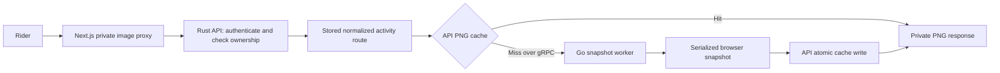

# Maps specification

This is the canonical contract for activity route PNGs and the internal snapshot
service. It replaces the map guide and map-renderer refactoring plan. Code,
generated transport schemas, and tests implement this contract; they do not
define product requirements. Review and release status live in
[MAP01](../TODO.md#active-work).

## Rider experience

- With `enhanced_maps` enabled, activity cards display a private route PNG in
  the rider's light or dark theme. With it disabled, cards retain the existing
  SVG route preview and do not call the snapshot service. Missing flags are
  disabled. `activity_list_full_maps` selects full images when enabled and
  thumbnails otherwise. Images load lazily; a preview with fewer than two
  route points displays **No route** in either mode.
- Thumbnail images are 288×192 CSS pixels; full images are 1000×300 CSS pixels.
  DPR is 1 or 2; PNG pixel dimensions are CSS dimensions multiplied by DPR.
  The UI selects DPR 2 when the device pixel ratio is at least 1.5, otherwise 1.
- Images use the retained light or Fiord dark basemap, a 3 CSS pixel `#0060df`
  route with 5 CSS pixel white casing beneath labels, 32 CSS pixels of framing
  padding, and maximum zoom 14. Route joins and caps are round.
  Attribution remains visible. Capture waits for loaded tiles and map idle.
- Interactive activity, segment, and race maps use normalized route geometry
  in MapLibre. They do not require the snapshot worker. Personal heatmap tiles
  follow the separate [heatmap contract](heatmaps.md).
- PNGs are derived displays. A missing or failed preview does not change the
  stored activity or imply that its import failed.

## Ownership and request flow

- The Rust API owns viewer authentication, activity ownership, route selection,
  PNG caching, conditional responses, and cache maintenance.
- The Next.js image route forwards viewer cookies/authorization, allowed
  synthetic credentials, W3C trace context, and `If-None-Match` to the API.
  It does not fetch activity JSON, submit coordinates, or hold the worker token.
- Rust checks current ownership before every cache lookup and every conditional
  response. A cached image or matching ETag never grants access. Missing,
  deleted, and other riders' activities all return 404.
- Rust obtains the activity's stored normalized route in order, removing
  non-finite or out-of-bounds coordinates. Fewer than two valid points returns
  404; more than 100,000 valid points returns 400. It does not fetch provider
  data or persist a new route to generate an image.
- The Go worker receives only route coordinates, rendering options, trace
  context, and service authentication. It has no account/database access,
  persistent PNG cache, or public ingress.

## Private HTTP image contract

The existing UI URL is
`/activity-map-images/{variant}/{styleVersion}?activityId={id}&theme={theme}&dpr={dpr}`.
The API serves the corresponding `/api/activity-map-images/...` URL.

| Input          | Accepted values                                              |
| -------------- | ------------------------------------------------------------ |
| `activityId`   | Positive integer identifying an activity owned by the viewer |
| `variant`      | `thumbnail` or `full`                                        |
| `styleVersion` | `1`                                                          |
| `theme`        | `light` or `dark`                                            |
| `dpr`          | `1` or `2`                                                   |

All inputs are required; invalid or unsupported values return 400. No theme,
size, or DPR default is inferred by the HTTP endpoint.

- Success returns 200 and PNG bytes with `Content-Type: image/png`.
- Both 200 and 304 include `Cache-Control: private, no-cache`,
  `Vary: Cookie, Authorization`, a quoted SHA-256 ETag of the PNG bytes, and
  `X-Map-Cache: hit` or `miss` for the API cache lookup.
- An `If-None-Match` value exactly equal to the current quoted ETag returns 304
  with an empty body after authentication and ownership checks. A differing
  value returns 200. Weak tags, lists, and wildcards do not match.
- Missing authentication returns 401; disabled accounts return 403 under the
  [shared authentication rules](auth-configuration.md#disabled-accounts).
  Missing activity/route or an unconfigured map service returns 404.
  Database and cache-read failures return 500.
  Worker transport/authentication/render failure, timeout, or a response without
  the PNG signature returns 502; failed snapshots are not cached.
- The UI preserves successful PNG/304 headers and bodies, forwards
  400/401/403/404 status, and maps API unavailability and other failures to 502.
  UI error responses have an empty body and `Cache-Control: no-store`.
  Rejected synthetic credentials return 403 before contacting the API.
- A cache hit remains usable while the snapshot worker is unavailable. A miss
  makes one snapshot RPC; the API does not retry a failed RPC automatically.

## PNG cache lifecycle and compatibility

- The API keys images by ordered normalized coordinates, theme, variant, DPR,
  and render revision. Activity IDs, owners, credentials, and trace context do
  not affect image identity. Identical permitted output can share one file.
- Moving the cache from the previous renderer preserves its revision-3 keys
  and existing PNGs, including ordered field encoding and JavaScript-compatible
  number serialization for zero, negative zero, and subnormal coordinates.
- Any change to pixels or attribution changes the render revision and the UI's
  image style version together. A new version must not return an old image.
- `MAP_IMAGE_CACHE_TTL_SECONDS` is positive and defaults to 604800 seconds
  (seven idle days). A successful cache read renews last use, including a read
  followed by 304. An entry idle longer than the TTL immediately misses even
  if a background sweep has not run.
- Cleanup runs at startup, hourly, and after a generated image is stored.
  It removes expired owned PNGs and abandoned owned temporary files, preserving
  unrelated files. Cache initialization or the initial prune failing prevents
  API startup. Later cleanup failures are reported and retried on the next sweep.
- Writes use temporary files and atomic rename so readers cannot receive a
  partially written image. A write failure still returns the generated PNG,
  increments the write-failure counter, and logs the failure.
- When cache storage succeeds, concurrent identical misses share the rendered
  result through an API cache recheck. Browser work is serialized; cache hits
  do not wait for Chromium.
  A failed render is not retained as a successful coalesced result.
- Activity deletion or changed ownership makes the old image inaccessible
  immediately through access checks. Changed geometry selects a different key;
  unreferenced images expire through the idle policy.

## Internal gRPC snapshot contract

The only application transport is `bike.maps.v1.MapService/Render` on port
50051, described by the [maps protobuf](../../proto/bike/maps/v1/maps.proto).
HTTP is used only for loopback browser assets and internal Prometheus metrics.

- A Render request requires 2–100,000 finite latitude/longitude pairs within
  inclusive bounds ±90/±180, `thumbnail|full`, `light|dark`, and DPR 1 or 2.
  Missing or invalid values return gRPC `InvalidArgument`.
- `MAP_SERVICE_TOKEN`, when configured, must match `authorization: Bearer ...`
  gRPC metadata; missing or incorrect metadata returns `Unauthenticated`
  before rendering. Production requires the shared token on API and worker;
  unconfigured authentication is restricted to explicit local/test setups.
- Requests are capped at 10,000,000 bytes and responses at 20,000,000 bytes.
  Rust reuses its connection, allows five seconds to connect, and sets a
  60-second RPC deadline. The UI also bounds its API fetch to 60 seconds.
- Success returns PNG bytes. Every accepted request produces a fresh snapshot;
  the retained protobuf `cache_hit` field is always false.
  Browser failures return gRPC `Internal`; transport limits/deadlines use gRPC
  transport errors. Rust exposes these failures as HTTP 502.
- One persistent Chromium process accepts FIFO work and renders one image at
  a time. Each render has an isolated browser context and a 45-second browser
  deadline. Browser warnings, errors, and page exceptions fail the snapshot.
- Caller cancellation or RPC expiry ends the caller's wait; already accepted
  browser work continues within its browser deadline. Queue waiting is separate
  from that deadline. Shutdown stops admission, attempts to drain accepted work
  within a 60-second shutdown budget, then closes Chromium and flushes telemetry.
- Standard gRPC health uses service name `bike.maps.v1.MapService` after Chromium
  starts. Docker health checks and Kubernetes readiness use this interface.
- Browser assets bind to loopback only, default `127.0.0.1:3100`.
  `MAP_ASSETS_ADDRESS` must specify a loopback IP and nonzero fixed port.
  Only explicit browser asset routes are served; `/render` and `/healthz` do
  not exist. Port 3100 is not exposed through the worker Service.
- Prometheus uses `/metrics` on port 9090. The worker Service exposes gRPC and
  metrics only; health and metrics do not require viewer authentication.

## Network visibility

OpenTelemetry instrumentation is required from the first release of this
boundary. Disabling export locally must not remove propagation/instrumentation.
An explicit `OTEL_SDK_DISABLED=true` disables tracing independently of export.

- Rust's `bike.maps.snapshot` CLIENT span injects W3C `traceparent` and
  `tracestate` into gRPC metadata. The Go gRPC SERVER span uses that remote
  parent; `bike.maps.render_queue_wait`, `bike.maps.render`,
  `bike.maps.browser_render`, and `bike.maps.screenshot` continue the trace.
- RPC visibility includes service/method, worker address/port, duration,
  gRPC status, and errors. Queue telemetry records waiting time separately from
  browser rendering. Coordinates and service credentials are excluded from
  RPC and render spans and metric labels.
- Both processes export OTLP when `OTEL_TRACES_EXPORTER=otlp` and
  `OTEL_EXPORTER_OTLP_ENDPOINT` selects a collector. Local export defaults to
  `none`; [the development guide](../development.md#inspect-traces) enables
  Jaeger. Production supplies service identity, version, and environment.
- API metrics own cache hits/misses, write failures, pruned files, disk bytes,
  image count, and miss/render latency. Worker metrics own gRPC status/latency,
  generated images, render failures/duration, queue wait/depth, in-flight work,
  and Go process/runtime metrics. Dashboards and alerts select the emitting
  service's scrape job; retired worker HTTP-render/cache series are not used.
- Individual Chromium tile-provider HTTP requests are outside the current
  trace contract. Browser pipeline spans measure their combined rendering
  cost; they do not establish per-provider network timing or propagation.

## Deployment constraints

- The API owns the existing protected cache claim and its data. The worker has
  no persistent volume; the UI has no worker credential. A single cache-owning
  API pod uses Recreate rollout to avoid concurrent volume ownership.
- A cache initializer using the same pinned API image makes the retained cache
  writable by UID/GID 65534 before the API starts as that user. Only the cache
  mount is included in that permission transfer.
- API configuration includes `MAP_RENDERER_GRPC_ADDRESS`, `MAP_SERVICE_TOKEN`,
  `MAP_IMAGE_CACHE_DIR`, and `MAP_IMAGE_CACHE_TTL_SECONDS`. Worker configuration
  includes the same token and its gRPC/metrics/loopback listeners.
- Coordinate API, UI, worker, and infrastructure image versions; this boundary
  cannot be released by changing only the worker. No database migration is
  required. [Deployment procedures](../deployment.md) own release commands.

## Acceptance and evidence

- Verify owner isolation on fresh, cached, and conditional requests; deletion,
  changed ownership, changed geometry, invalid inputs, and absent route data.
- Verify exact PNG dimensions and retained pixels for all eight theme/variant/
  DPR combinations with frozen basemaps. Check current providers separately.
- Verify idle renewal/expiry, cleanup scope, atomic writes, successful miss
  coalescing, cache-write failure, worker failure, and ETag/304 behavior.
- Verify gRPC validation/authentication/health, FIFO isolation, cancellation,
  deadlines, and shutdown; verify CLIENT/SERVER trace identity and children
  through an actual OTLP export to a test collector.
- Verify a connected UI → Rust → Go/Chromium image using prepared test data.
  Fixtures and mocked transport tests do not establish live provider behavior.
- After release, verify immutable images, gRPC readiness, a private UI PNG,
  revalidation, API cache metrics, worker metrics, and collector receipt.
  Passing local/CI checks does not establish production behavior.

[PR #17](https://github.com/ericbutera/bike/pull/17) contains the implementation
and review evidence. Runtime commands and style synchronization live in the
[snapshot worker README](../../map-renderer/README.md). Historical local
measurements are recorded there; they are not performance requirements.
